# 21 — Feature and configuration coverage map

[← Previous](./20_Best_Practices_And_When_Not_Actions.md) · [README](./README.md) · [Next: YAML catalog →](./22_YAML_And_Configuration_Catalog.md)

## 1. Concepts

This chapter is the **final product-offering map** for GitHub Actions: every major surface the product exposes — whether it ships on Free, Pro, Team, Enterprise, or is plan-/SKU-gated. Plan names and minute tables change; **the feature still belongs on the map**. Confirm current availability and quotas in References when you implement.

After this map you should be able to:

- Point at any official Actions area and name the handbook chapter that teaches it  
- Tell free/default surfaces from larger-runner / enterprise / GHE extras without pretending gated features “don’t exist”  
- Know what stays upstream as cookbooks (language CI, cloud deploy click-paths, Marketplace encyclopedia)

### Offering diagram (whole product)

```mermaid
flowchart TB
  subgraph triggers [Triggers and control plane]
    EV[Events: push PR schedule dispatch call run external…]
    UI[Actions UI: runs graph logs badges enable/disable]
    ADM[Org/enterprise admin: policies metrics GHE namespaces]
  end

  subgraph authoring [Authoring model]
    WF[Workflows YAML]
    JOB[Jobs needs if matrix concurrency]
    STEP[Steps run / uses]
    CTX[Contexts expressions vars secrets]
    CMD[Workflow commands / env files]
    REUSE[Reusable workflows · composites · templates · YAML anchors]
    ACT[Custom actions: JS · composite · Docker · Marketplace]
  end

  subgraph compute [Compute]
    GH[GitHub-hosted standard]
    LR[Larger runners · custom images · static IP / VNet]
    SH[Self-hosted · labels · groups · proxies · hooks]
    ARC[ARC · runner scale sets on Kubernetes]
    CTR[Job container · service containers]
  end

  subgraph data [Data handoff]
    CACHE[Dependency caches]
    ART[Workflow artifacts]
    PKG[Publish packages / images]
  end

  subgraph identity [Identity and secrets]
    TOK[GITHUB_TOKEN permissions]
    SEC[Repo / org / environment secrets and vars]
    OIDC[OIDC to clouds · Vault · registries · reusable job_workflow_ref]
    FORK[Fork approvals · pull_request_target caution]
  end

  subgraph ship [Ship and prove]
    ENV[Environments · reviewers · wait · branch rules]
    PROT[Custom deployment protection rules Apps]
    ATT[Artifact attestations · SLSA patterns · K8s admission · offline verify]
    DEP[Deploy / promote-by-digest · GitOps handoff]
  end

  subgraph observe [Observe and scale]
    MET[Metrics · job time · notifications]
    LIM[Limits · billing / minutes / storage]
    DBG[Debug logging · condition logs · Support]
  end

  subgraph migrate [Migrate and extras]
    IMP[Actions Importer · manual migration guides]
    AGENT[Agentic workflows literacy]
    AUTO[Repo automation samples]
  end

  EV --> WF
  UI --> WF
  WF --> JOB --> STEP
  STEP --> ACT
  STEP --> CTR
  JOB --> GH & LR & SH & ARC
  CTX --> JOB
  REUSE --> JOB
  STEP --> CACHE & ART & PKG
  TOK & SEC & OIDC --> JOB
  JOB --> ENV --> PROT
  JOB --> ATT
  ENV --> DEP
  JOB --> MET & LIM & DBG
  ADM --> MET
  IMP --> WF
  AGENT --> WF
```

**How to read plan gates:** everything on the diagram is a real product surface. Larger runners, custom images, some private-networking modes, enterprise sharing, GHE.com namespace tooling, and concurrency/minute ceilings vary by plan or SKU — list them here; buy/enable them when you need them. Do not omit a capability because it is paid.

## 2. Advanced — full offering inventory

### A. Product identity

| Offering | What it is | Track |
|----------|------------|-------|
| GitHub Actions | Workflow automation on GitHub | [01](./01_What_Is_GitHub_Actions.md) |
| CI / CD with Actions | Build-test vs deploy lanes | [01](./01_What_Is_GitHub_Actions.md) |
| Actions vs GitHub Apps | Workflow runs vs durable App identity | [01](./01_What_Is_GitHub_Actions.md) |
| Core model | Workflow → run → job → step → runner / action / `GITHUB_TOKEN` | [02](./02_Core_Model_Workflows_Jobs_Steps_Runners.md) |

### B. Triggers, UI, and run operations

| Offering | What it is | Track |
|----------|------------|-------|
| Event catalog | `push`, `pull_request`, `pull_request_target`, `schedule`, `workflow_dispatch`, `workflow_call`, `workflow_run`, `repository_dispatch`, release/issue/… | [05](./05_Events_And_Triggers.md) |
| Filters | Branches/tags/paths/types | [05](./05_Events_And_Triggers.md) |
| Workflow templates | Starter YAML; org templates | [03](./03_First_Workflow_And_Actions_UI.md), [13](./13_Reusable_Workflows_And_Composites.md) |
| Actions UI | Runs, graph, logs, history, job time | [03](./03_First_Workflow_And_Actions_UI.md), [18](./18_Monitor_Metrics_And_Billing_Literacy.md) |
| Manual run | `workflow_dispatch` + inputs | [03](./03_First_Workflow_And_Actions_UI.md), [05](./05_Events_And_Triggers.md) |
| Re-run / cancel / delete runs | Operate completed or in-flight runs | [03](./03_First_Workflow_And_Actions_UI.md), [23](./23_Troubleshooting_And_Staff_Checklist.md) |
| Enable / disable / skip workflows | Stop triggers without deleting YAML; skip directives | [03](./03_First_Workflow_And_Actions_UI.md) |
| Status badges | README / docs signal | [03](./03_First_Workflow_And_Actions_UI.md) |
| Fork run approvals | Gate untrusted contributor workflows | [16](./16_Security_Hardening_Permissions_And_Forks.md) |
| Required checks / rulesets | Merge gates (platform adjacent) | [03](./03_First_Workflow_And_Actions_UI.md), [23](./23_Troubleshooting_And_Staff_Checklist.md) |

### C. Workflow language and craft

| Offering | What it is | Track |
|----------|------------|-------|
| Workflow syntax | Full YAML surface (`on`, `jobs`, `permissions`, …) | [04](./04_Workflow_Syntax_Mental_Model.md), [22](./22_YAML_And_Configuration_Catalog.md) |
| Workflow file size gate | ≤ **500 KB** per file | [04](./04_Workflow_Syntax_Mental_Model.md), [18](./18_Monitor_Metrics_And_Billing_Literacy.md) |
| Jobs / `needs` / outputs | DAG + handoff | [06](./06_Jobs_Needs_Concurrency_And_Matrix.md) |
| Conditionals | Job/step `if:` | [06](./06_Jobs_Needs_Concurrency_And_Matrix.md), [07](./07_Contexts_Expressions_And_Variables.md) |
| Concurrency | Groups; cancel; **`queue: max`** | [06](./06_Jobs_Needs_Concurrency_And_Matrix.md) |
| Matrix | OS/version fan-out; **≤ 256 jobs/run** | [06](./06_Jobs_Needs_Concurrency_And_Matrix.md) |
| Defaults | Shell / working-directory | [04](./04_Workflow_Syntax_Mental_Model.md) |
| Contexts / expressions / variables | `${{ }}`, `vars`, default env | [07](./07_Contexts_Expressions_And_Variables.md) |
| Workflow commands | Notices, masks, `$GITHUB_ENV` / `OUTPUT` / `PATH` / summaries | [04](./04_Workflow_Syntax_Mental_Model.md), [22](./22_YAML_And_Configuration_Catalog.md) |
| Cancellation behavior | How cancel propagates | [22](./22_YAML_And_Configuration_Catalog.md) — limits/cancellation refs |
| GitHub CLI in workflows | `gh` scripting | [22](./22_YAML_And_Configuration_Catalog.md) |
| Scripts in steps | `run:` ownership | [04](./04_Workflow_Syntax_Mental_Model.md) |

### D. Compute — every runner class

| Offering | What it is | Plan note | Track |
|----------|------------|-----------|-------|
| Standard GitHub-hosted | `ubuntu-latest` / Windows / macOS labels | Minutes by plan | [08](./08_GitHub_Hosted_Runners.md) |
| Customize hosted job | Install tools in-job | — | [08](./08_GitHub_Hosted_Runners.md) |
| Job `container:` | Steps inside a container on the VM | — | [08](./08_GitHub_Hosted_Runners.md) |
| Service containers | Postgres/Redis/… sidecars | — | [24](./24_Migrate_Packages_And_Extras.md) |
| Larger runners | More CPU/RAM; concurrency SKUs | Team/Enterprise SKUs | [08](./08_GitHub_Hosted_Runners.md) |
| Custom images (larger) | Org/enterprise golden images | Storage quotas by plan | [08](./08_GitHub_Hosted_Runners.md) |
| Larger runner access control | Groups / policies | Org/enterprise | [08](./08_GitHub_Hosted_Runners.md), [09](./09_Self_Hosted_Runners_And_Groups.md) |
| Private networking | API gateway + OIDC; WireGuard; Azure VNet injection | Often larger / cloud setup | [08](./08_GitHub_Hosted_Runners.md) |
| View current jobs | Hosted capacity visibility | Org/enterprise views | [18](./18_Monitor_Metrics_And_Billing_Literacy.md) |
| Self-hosted runners | Your machines; labels; service mode | Your ops cost | [09](./09_Self_Hosted_Runners_And_Groups.md) |
| Runner groups | Tenancy / workflow allowlists | Org/enterprise | [09](./09_Self_Hosted_Runners_And_Groups.md) |
| Pre/post job scripts | Host hooks around jobs | Self-hosted | [09](./09_Self_Hosted_Runners_And_Groups.md) |
| Container customization | How self-hosted invokes job containers | Self-hosted | [09](./09_Self_Hosted_Runners_And_Groups.md) |
| Proxies | Isolated network egress | Self-hosted / ARC | [09](./09_Self_Hosted_Runners_And_Groups.md), [10](./10_Actions_Runner_Controller_ARC.md) |
| ARC + scale sets | Elastic runners on Kubernetes | Your cluster | [10](./10_Actions_Runner_Controller_ARC.md) |
| ARC auth / deploy / workflow use | Platform install literacy | — | [10](./10_Actions_Runner_Controller_ARC.md) |
| Migrate self-hosted → hosted | Assessment guide | — | [24](./24_Migrate_Packages_And_Extras.md) |

### E. Actions ecosystem (consume and publish)

| Offering | What it is | Track |
|----------|------------|-------|
| Marketplace / `uses:` | Pre-written building blocks | [11](./11_Actions_Marketplace_And_Pinning.md) |
| Pinning | Tags vs SHA; immutable releases literacy | [11](./11_Actions_Marketplace_And_Pinning.md) |
| JavaScript / composite / Docker actions | Action types you can author | [11](./11_Actions_Marketplace_And_Pinning.md), [24](./24_Migrate_Packages_And_Extras.md) |
| Metadata / Dockerfile support | `action.yml` + container action constraints | [11](./11_Actions_Marketplace_And_Pinning.md), [22](./22_YAML_And_Configuration_Catalog.md) |
| Publish to Marketplace | Share publicly | [24](./24_Migrate_Packages_And_Extras.md) |
| Release / maintain / exit codes | Publisher lifecycle | [24](./24_Migrate_Packages_And_Extras.md) |
| Share private / org / enterprise | Internal reuse without public Marketplace | [13](./13_Reusable_Workflows_And_Composites.md) |

### F. Reuse and paved road

| Offering | What it is | Track |
|----------|------------|-------|
| Reusable workflows (`workflow_call`) | Org paved road as a job | [13](./13_Reusable_Workflows_And_Composites.md) |
| `secrets: inherit` / explicit secrets | Secret plumbing across call boundary | [13](./13_Reusable_Workflows_And_Composites.md), [14](./14_Secrets_Variables_And_Environments.md) |
| Composite actions | Local reusable steps | [13](./13_Reusable_Workflows_And_Composites.md) |
| YAML anchors / aliases | In-file DRY | [13](./13_Reusable_Workflows_And_Composites.md) |
| Org workflow templates | Scaffolding for teams | [13](./13_Reusable_Workflows_And_Composites.md) |
| OIDC + reusable (`job_workflow_ref`) | Cloud trust on the paved workflow | [13](./13_Reusable_Workflows_And_Composites.md), [15](./15_OIDC_And_Cloud_Federation.md) |

### G. Caches, artifacts, packages

| Offering | What it is | Track |
|----------|------------|-------|
| Dependency caching | Speed; eviction; rate limits | [12](./12_Caches_And_Artifacts.md) |
| Manage caches | List/delete/monitor | [12](./12_Caches_And_Artifacts.md) |
| Workflow artifacts | Upload/download/remove; retention | [12](./12_Caches_And_Artifacts.md) |
| Publish Docker / npm / Maven / Gradle | Registry publish tutorials | [19](./19_Worked_Example_CI_Build_And_Promote.md), [24](./24_Migrate_Packages_And_Extras.md) |

### H. Secrets, environments, deploy

| Offering | What it is | Track |
|----------|------------|-------|
| Secrets (repo/org/environment) | Sensitive config | [14](./14_Secrets_Variables_And_Environments.md) |
| Variables | Non-secret config | [14](./14_Secrets_Variables_And_Environments.md), [07](./07_Contexts_Expressions_And_Variables.md) |
| `GITHUB_TOKEN` | Built-in run token; permission model; recursion | [14](./14_Secrets_Variables_And_Environments.md), [16](./16_Security_Hardening_Permissions_And_Forks.md) |
| Deployment environments | Named targets + env secrets/vars | [14](./14_Secrets_Variables_And_Environments.md), [17](./17_Deploy_Environments_And_Promote.md) |
| Protection rules | Reviewers, wait timer, deployment branches | [14](./14_Secrets_Variables_And_Environments.md), [17](./17_Deploy_Environments_And_Promote.md) |
| Custom deployment protection rules | GitHub Apps as external gates | [17](./17_Deploy_Environments_And_Promote.md) |
| Review deployments / history | Human gate + audit UI | [17](./17_Deploy_Environments_And_Promote.md) |
| Deploy with Actions | Environments + concurrency + promote | [17](./17_Deploy_Environments_And_Promote.md) |
| Promote-by-digest | Immutable ship | [17](./17_Deploy_Environments_And_Promote.md), [19](./19_Worked_Example_CI_Build_And_Promote.md) |
| Cloud deploy cookbooks | Azure/AWS/GCP/Xcode signing samples | Upstream how-tos — same job shape as [17](./17_Deploy_Environments_And_Promote.md) |

### I. OIDC and cloud federation

| Offering | What it is | Track |
|----------|------------|-------|
| OIDC tokens from Actions | Short-lived JWT per job | [15](./15_OIDC_And_Cloud_Federation.md) |
| Provider how-tos | AWS, Azure, GCP, Vault, JFrog, Octopus, PyPI, generic | [15](./15_OIDC_And_Cloud_Federation.md) — cookbooks upstream |
| API gateway with OIDC | Private-net pattern | [08](./08_GitHub_Hosted_Runners.md), [15](./15_OIDC_And_Cloud_Federation.md) |
| Repository custom properties as claims | ABAC-style trust | [15](./15_OIDC_And_Cloud_Federation.md) |
| OIDC reference | Claim/issuer details | [15](./15_OIDC_And_Cloud_Federation.md) |

### J. Security and supply chain

| Offering | What it is | Track |
|----------|------------|-------|
| Least-privilege `permissions` | Scope `GITHUB_TOKEN` | [16](./16_Security_Hardening_Permissions_And_Forks.md) |
| Secure use reference | Staff hardening guide | [16](./16_Security_Hardening_Permissions_And_Forks.md) |
| Script injection guidance | Untrusted input in `run:` | [16](./16_Security_Hardening_Permissions_And_Forks.md) |
| `pull_request_target` secure use | Base-privileged event foot-gun | [05](./05_Events_And_Triggers.md), [16](./16_Security_Hardening_Permissions_And_Forks.md) |
| Compromised runners guidance | Host isolation mindset | [16](./16_Security_Hardening_Permissions_And_Forks.md), [09](./09_Self_Hosted_Runners_And_Groups.md) |
| Artifact attestations / provenance | Build evidence | [16](./16_Security_Hardening_Permissions_And_Forks.md), [17](./17_Deploy_Environments_And_Promote.md) |
| SLSA-oriented patterns | Attestations + reusable workflows | [16](./16_Security_Hardening_Permissions_And_Forks.md) |
| Verify attestations offline | Air-gap verify path | [16](./16_Security_Hardening_Permissions_And_Forks.md) |
| Attestation lifecycle | Search/delete | [16](./16_Security_Hardening_Permissions_And_Forks.md) |
| Kubernetes admissions controller | Enforce attestations at admit | [16](./16_Security_Hardening_Permissions_And_Forks.md) |

### K. Observe, bill, administer

| Offering | What it is | Plan note | Track |
|----------|------------|-----------|-------|
| Actions metrics | Org/repo usage and performance views | Org features vary | [18](./18_Monitor_Metrics_And_Billing_Literacy.md) |
| Notifications | Subscribe to run outcomes | — | [18](./18_Monitor_Metrics_And_Billing_Literacy.md) |
| Billing and usage | Minutes, storage, spending limits | Free allowances + paid | [18](./18_Monitor_Metrics_And_Billing_Literacy.md) |
| Actions limits | Runtime, matrix, queue, API, cache rates, concurrency tables | Confirm live | [18](./18_Monitor_Metrics_And_Billing_Literacy.md) |
| Debug / condition logs | Deep troubleshooting | — | [18](./18_Monitor_Metrics_And_Billing_Literacy.md), [23](./23_Troubleshooting_And_Staff_Checklist.md) |
| GHE.com retired namespaces | Admin restore of action namespaces | GHE.com | [24](./24_Migrate_Packages_And_Extras.md) |
| Support boundary | What Support covers (incl. ARC notes) | — | [10](./10_Actions_Runner_Controller_ARC.md), [23](./23_Troubleshooting_And_Staff_Checklist.md) |

### L. Migrate, automate, assisted

| Offering | What it is | Track |
|----------|------------|-------|
| GitHub Actions Importer | Automated migration + transformers + settings | [24](./24_Migrate_Packages_And_Extras.md) |
| Manual migration guides | Jenkins/CircleCI/GitLab/Azure/Travis patterns | [24](./24_Migrate_Packages_And_Extras.md) |
| Importer source CI pages | Azure DevOps, Bamboo, Bitbucket, CircleCI, GitLab, Jenkins, Travis | Upstream tutorials — literacy in [24](./24_Migrate_Packages_And_Extras.md) |
| Language CI tutorials | Go, Java, .NET, Node, Python, Ruby, Rust, Swift, … | Upstream — shape in [19](./19_Worked_Example_CI_Build_And_Promote.md) |
| Issue/label/schedule repo bots | Sample automations | Upstream samples — judgment in [20](./20_Best_Practices_And_When_Not_Actions.md) |
| Agentic workflows | Markdown→agent automations | Literacy [24](./24_Migrate_Packages_And_Extras.md) |

### M. Craft chapters (not product SKUs)

| Chapter | Role |
|---------|------|
| [19](./19_Worked_Example_CI_Build_And_Promote.md) | Lab: CI → digest → gated promote |
| [20](./20_Best_Practices_And_When_Not_Actions.md) | Judgment |
| [22](./22_YAML_And_Configuration_Catalog.md) | Config surface index |
| [23](./23_Troubleshooting_And_Staff_Checklist.md) | Playbook + staff checklist |

### N. Explicitly upstream (feature exists; encyclopedia not duplicated)

| Surface | Why upstream |
|---------|----------------|
| Full workflow-syntax / events / contexts / expressions field lists | Versioned references — use when implementing |
| Hosted / larger / self-hosted runner hardware tables | Change often — runner references |
| Every Marketplace action README | Pin and read what you adopt |
| Every cloud deploy cookbook page | Same promote job; cloud UI churns |
| Every language build-and-test tutorial | Same CI shape; toolchain churns |
| Full Importer CLI args / per-CI deep pages | Accelerator docs |
| ARC Helm values / error-code runbooks | Platform ops |
| Agentic workflow deep recipes | Optional assisted lane |

## 3. Applications and use cases

Walk **A–L** for your estate. Mark each row **use / later / N/A**. Include paid/SKU rows even if you are on Free today — that is how you know what to buy when queue time, macOS concurrency, custom images, or VNet injection show up.

Prefer closing gaps in **H–J** (deploy, OIDC, hardening) before collecting more language tutorials.

## References

- [GitHub Actions documentation](https://docs.github.com/en/actions)  
- [Workflow syntax](https://docs.github.com/en/actions/reference/workflows-and-actions/workflow-syntax)  
- [Events that trigger workflows](https://docs.github.com/en/actions/reference/workflows-and-actions/events-that-trigger-workflows)  
- [Actions limits](https://docs.github.com/en/actions/reference/limits)  
- [Billing and usage](https://docs.github.com/en/actions/concepts/billing-and-usage)  
- [Larger runners](https://docs.github.com/en/actions/concepts/runners/larger-runners)  
- [Artifact attestations](https://docs.github.com/en/actions/concepts/security/artifact-attestations)  
- [OpenID Connect](https://docs.github.com/en/actions/concepts/security/openid-connect)  
'''
