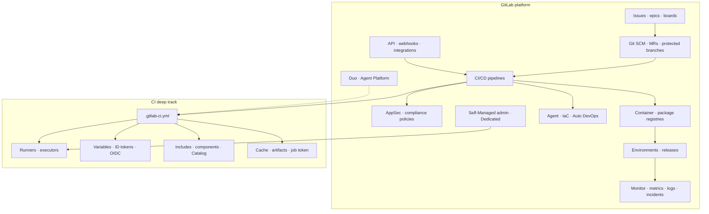

# 24 — Feature and offering coverage map

[← Previous](./23_Best_Practices_And_When_Not_GitLab.md) · [README](./README.md) · [Next: Catalog →](./25_YAML_Catalog_And_Troubleshooting.md)

## 1. Concepts

Final **product-offering map**: CI deeply, plus the majority of GitLab’s platform surface as literacy. Tier/offering gates (Free/Premium/Ultimate, Duo add-ons, Dedicated) change — **list the capability anyway**; confirm availability in References when implementing.

### Offering diagram

## 2. Advanced — inventory

### A. Platform foundation

| Offering | Track |
|----------|-------|
| What GitLab is; SaaS / Self-Managed / Dedicated; tiers | [01](./01_What_Is_GitLab.md) |
| Groups / projects / namespaces | [02](./02_Groups_Projects_And_Namespaces.md) |
| SCM / MRs / protection | [03](./03_SCM_Merge_Requests_And_Code_Review.md) |
| Planning literacy | [04](./04_Planning_And_Work_Items_Literacy.md) |

### B. CI/CD (primary depth)

| Offering | Track |
|----------|-------|
| Pipelines / jobs / stages | [05](./05_CI_Core_Model_Pipelines_Jobs_Stages.md) |
| First pipeline / UI / lint | [06](./06_First_Pipeline_And_CI_UI.md) |
| YAML keywords map | [07](./07_YAML_Mental_Model_And_Keywords.md) |
| Rules / workflow / MR & merge trains | [08](./08_Rules_Workflow_And_Pipeline_Types.md) |
| Needs / downstream / architectures | [09](./09_Needs_DAG_And_Downstream_Pipelines.md) |
| Runners / executors / tags | [10](./10_Runners_And_Executors.md) |
| Images / services / DinD / Buildah | [11](./11_Images_Services_And_Docker_Build.md) |
| Cache / artifacts / job token | [12](./12_Caching_Artifacts_And_Job_Tokens.md) |
| Includes / components / Catalog | [13](./13_Includes_Components_And_CI_Catalog.md) |
| Variables / secrets / ID tokens / OIDC | [14](./14_Variables_Secrets_And_OIDC.md) |
| Environments / review apps / release | [15](./15_Environments_Deployments_And_Release.md) |
| `parallel` / matrix; expressions | [07](./07_YAML_Mental_Model_And_Keywords.md), [09](./09_Needs_DAG_And_Downstream_Pipelines.md) |
| Testing reports (JUnit/coverage/…) | [12](./12_Caching_Artifacts_And_Job_Tokens.md) |
| DinD / Kaniko / Buildah; GCP integration door | [11](./11_Images_Services_And_Docker_Build.md) |
| Fleeting / interactive web terminal | [10](./10_Runners_And_Executors.md) |

### C. Ship, secure, infra, observe, AI

| Offering | Track |
|----------|-------|
| Packages / registry / dependency proxy | [16](./16_Packages_Container_Registry_And_Dependency_Proxy.md) |
| AppSec / compliance literacy | [17](./17_Security_Scanning_And_Compliance_Literacy.md) |
| Agent / Auto DevOps / infrastructure | [18](./18_Agent_Auto_DevOps_And_Infrastructure.md) |
| **Monitor / operations literacy** (metrics, logs, tracing, incidents) | Door: [01](./01_What_Is_GitLab.md) + [operations docs](https://docs.gitlab.com/operations/) — not a second observability book |
| Wiki / GitLab Pages / snippets | SCM-adjacent product doors — [user docs](https://docs.gitlab.com/user/); not CI depth |
| Duo / Agent Platform literacy | [19](./19_Duo_And_AI_Literacy.md) |
| Self-Managed admin literacy (incl. Geo) | [20](./20_Self_Managed_Admin_Literacy.md) |
| API / webhooks / integrations | [21](./21_API_Webhooks_And_Integrations.md) |

### D. Craft

| Offering | Track |
|----------|-------|
| Lab | [22](./22_Worked_Example_CI_Build_And_Promote.md) |
| Practices | [23](./23_Best_Practices_And_When_Not_GitLab.md) |
| YAML catalog + troubleshoot | [25](./25_YAML_Catalog_And_Troubleshooting.md) |
| Migrate / plans / extras (ChatOps, mobile, sustainability, …) | [26](./26_Migrate_Plans_And_Extras.md) |

### E. CI docs subtree → chapter (completeness check)

Every `doc/ci/` area maps here or upstream:

| `doc/ci/` area | Track |
|----------------|-------|
| `yaml/`, `pipelines/`, `jobs/`, `quick_start/`, `pipeline_editor/`, `debugging` | [05](./05_CI_Core_Model_Pipelines_Jobs_Stages.md)–[09](./09_Needs_DAG_And_Downstream_Pipelines.md), [25](./25_YAML_Catalog_And_Troubleshooting.md) |
| `runners/` | [10](./10_Runners_And_Executors.md) |
| `docker/`, `services/` | [11](./11_Images_Services_And_Docker_Build.md) |
| `caching/`, `testing/` (reports) | [12](./12_Caching_Artifacts_And_Job_Tokens.md) |
| `components/`, `inputs/` | [13](./13_Includes_Components_And_CI_Catalog.md) |
| `variables/`, `secrets/`, `secure_files/`, `cloud_services/`, `pipeline_security/` | [14](./14_Variables_Secrets_And_OIDC.md), [17](./17_Security_Scanning_And_Compliance_Literacy.md) |
| `environments/`, `review_apps/`, `resource_groups/` | [15](./15_Environments_Deployments_And_Release.md), [09](./09_Needs_DAG_And_Downstream_Pipelines.md) |
| `triggers/` | [21](./21_API_Webhooks_And_Integrations.md) |
| `migration/`, `ci_cd_for_external_repos/`, `chatops/`, `mobile_devops/`, `sustainability/` | [26](./26_Migrate_Plans_And_Extras.md) |
| `examples/` | [22](./22_Worked_Example_CI_Build_And_Promote.md) |
| `cloud_deployment/`, `gitlab_google_cloud_integration/` | Promote shape [15](./15_Environments_Deployments_And_Release.md); cookbooks upstream |
| `functions/`, `interactive_web_terminal/`, `test_cases/` | Expressions [07](./07_YAML_Mental_Model_And_Keywords.md); terminal [10](./10_Runners_And_Executors.md); planning/secure doors [04](./04_Planning_And_Work_Items_Literacy.md)/[17](./17_Security_Scanning_And_Compliance_Literacy.md) |

### F. Intentionally upstream

| Surface | Why |
|---------|-----|
| Full CI YAML keyword encyclopedia | Use reference when implementing |
| Every AppSec scanner cookbook | Same include pattern; fields churn |
| Every administration runbook / ref-arch BOM | Ops encyclopedia |
| Full Monitor/Observability product depth | Operations docs — door only here |
| `development/` contributor docs | Not operator literacy |
| Every cloud deploy sample (ECS/Heroku/GCP click-path) | Same promote job |
| Full API resource list | API docs |
| Duo prompt encyclopedias | Product moves fast |

## 3. Applications and use cases

Walk A–C for your estate: **use / later / N/A**. Include Ultimate/Duo rows even on Free — that is how you know what to buy later.

## References

- [GitLab Docs](https://docs.gitlab.com/)  
- [CI/CD](https://docs.gitlab.com/ci/)  
- [CI/CD YAML](https://docs.gitlab.com/ci/yaml/)  
- [Monitor / operations](https://docs.gitlab.com/operations/)  
- [Subscriptions](https://docs.gitlab.com/subscriptions/)  
