# 24 — Feature and offering coverage map

[← Previous](./23_Best_Practices_And_When_Not_Jenkins.md) · [README](./README.md) · [Next: Config catalog →](./25_Jenkinsfile_JCasC_And_Config_Catalog.md)

## 1. Concepts

Final **product + configuration map** for Jenkins. Jenkins is open-source and infinitely plugin-extended — this track covers **every major offering class and configuration surface** operators actually run. Individual plugin encyclopedias and the live Pipeline steps reference stay upstream; they still belong on this map as *classes*.

After this map you should be able to:

- Point at any User Handbook area and name the chapter that teaches it  
- Name every controller configuration surface (UI, JCasC, init, properties, CLI/API)  
- Tell Freestyle / Pipeline / Multibranch / Org Folder / Folder / matrix apart  
- Know what is intentionally upstream (plugins.jenkins.io, language tutorials, extender Javadoc)

### Offering diagram (whole product)

```mermaid
flowchart TB
  subgraph control [Controller and config]
    LTS[LTS / weekly controller]
    UI[Manage Jenkins UI]
    JCASC[JCasC YAML]
    INIT[Groovy init / hooks]
    PROP[System properties / params]
    HOME[$JENKINS_HOME]
  end

  subgraph items [Items and organization]
    FS[Freestyle]
    MX[Multi-config / matrix]
    PIPE[Pipeline job]
    MB[Multibranch]
    ORG[Organization Folder]
    FLD[Folders / views]
  end

  subgraph authoring [Authoring]
    JF[Jenkinsfile Declarative / Scripted]
    SYN[agent when parallel matrix post options…]
    LIB[Shared libraries]
    DSL[Job DSL literacy]
    STEPS[Pipeline steps / plugins]
  end

  subgraph compute [Compute]
    BI[Built-in node — minimize]
    AG[Permanent agents SSH / inbound / WebSocket]
    DOC[Docker Pipeline agents]
    CLOUD[Clouds: Docker K8s EC2 Azure…]
    TOOLS[Global tools / image bake]
  end

  subgraph data [Secrets and data]
    CRED[Credentials + binding]
    TRIG[Webhooks Poll cron remote API]
    ART[Artifacts fingerprints stash]
    STOR[Pluggable storage literacy]
  end

  subgraph secure [Secure]
    AUTH[Authn realm / SSO]
    AUTHZ[Authz matrix role folder]
    CSRF[CSRF CSP markup]
    SCR[Script security / approval]
    A2C[Agent-to-controller]
    BAUTH[Build authorization]
    ISO[Controller isolation]
  end

  subgraph ops [Operate]
    PLUG[Plugins Update Center]
    BAK[Backup restore]
    PROXY[Reverse proxy TLS WebSocket]
    MON[Monitor logs thread dumps]
    HA[Scale / HA literacy]
    API[CLI Remote API]
    BO[Blue Ocean literacy]
  end

  LTS --> UI & JCASC & INIT & PROP & HOME
  UI --> FS & MX & PIPE & MB & ORG & FLD
  PIPE & MB --> JF --> SYN & LIB & STEPS
  LTS --> BI & AG & DOC & CLOUD & TOOLS
  JF --> CRED & TRIG & ART
  LTS --> AUTH & AUTHZ & CSRF & SCR & A2C & BAUTH & ISO
  LTS --> PLUG & BAK & PROXY & MON & HA & API & BO
```

**How to read plugins:** every cloud, SCM, notifier, and deployer is usually a plugin. The *capability* is in-scope; the *specific plugin page* is upstream after you pin it.

## 2. Advanced — full offering inventory

### A. Product identity and install

| Offering / config | What it is | Track |
|-------------------|------------|-------|
| Jenkins automation server | Controller + agents; Freestyle/Pipeline | [01](./01_What_Is_Jenkins.md) |
| LTS vs weekly | Production vs bleeding edge | [01](./01_What_Is_Jenkins.md), [02](./02_Install_Controller_And_LTS.md), [26](./26_Migrate_LTS_Upgrades_And_Extras.md) |
| Linux packages / systemd | Classic VM install | [02](./02_Install_Controller_And_LTS.md) |
| Docker / Compose | Containerized controller | [02](./02_Install_Controller_And_LTS.md) |
| WAR + Java | Generic servlet / `java -jar` | [02](./02_Install_Controller_And_LTS.md) |
| Windows / macOS / other | Platform install guides | [02](./02_Install_Controller_And_LTS.md) |
| Kubernetes / Helm | Cloud-native controller | [02](./02_Install_Controller_And_LTS.md), [20](./20_Scaling_HA_Backup_And_Monitoring.md) |
| Setup wizard | Admin password, plugins, first user | [02](./02_Install_Controller_And_LTS.md) |
| Offline / air-gap install | Vendored plugins | [02](./02_Install_Controller_And_LTS.md), [17](./17_Plugins_Update_Center_And_Hygiene.md) |
| Initial settings / root URL | Controller URL, executors, mail | [02](./02_Install_Controller_And_LTS.md), [19](./19_Managing_Tools_Nodes_Users_And_System.md) |
| Platform support (Java/OS/browsers) | Supported combinations | [02](./02_Install_Controller_And_LTS.md), [26](./26_Migrate_LTS_Upgrades_And_Extras.md) |
| Java upgrade paths (11/17/21) | Platform information | [26](./26_Migrate_LTS_Upgrades_And_Extras.md) |
| Custom CA certificates | Docker/K8s TLS trust | [02](./02_Install_Controller_And_LTS.md), [20](./20_Scaling_HA_Backup_And_Monitoring.md) |
| Servlet containers | Requirements literacy | [02](./02_Install_Controller_And_LTS.md) |

### B. Architecture

| Offering / config | What it is | Track |
|-------------------|------------|-------|
| Controller vs agent | Where UI/queue live vs where builds run | [03](./03_Architecture_Controller_Agents_Executors.md) |
| Executors | Parallelism slots per node | [03](./03_Architecture_Controller_Agents_Executors.md) |
| Labels / expressions | Route jobs to capacity | [03](./03_Architecture_Controller_Agents_Executors.md), [11](./11_Agents_Clouds_Docker_And_Kubernetes.md) |
| Built-in node | Prefer **0** build executors | [03](./03_Architecture_Controller_Agents_Executors.md), [19](./19_Managing_Tools_Nodes_Users_And_System.md) |
| Built-in node name/label migration | Historical rename | [19](./19_Managing_Tools_Nodes_Users_And_System.md) |
| `$JENKINS_HOME` | State: jobs, configs, plugins, secrets | [04](./04_Configuration_Surfaces_UI_JCasC_And_Init.md), [20](./20_Scaling_HA_Backup_And_Monitoring.md) |
| Workspaces | Per-job directories on agents | [03](./03_Architecture_Controller_Agents_Executors.md), [15](./15_Artifacts_Fingerprints_And_Promotions.md) |
| Executor starvation | Queue stuck literacy | [03](./03_Architecture_Controller_Agents_Executors.md), [25](./25_Jenkinsfile_JCasC_And_Config_Catalog.md) |

### C. Configuration surfaces (every kind)

| Offering / config | What it is | Track |
|-------------------|------------|-------|
| Manage Jenkins UI | System, security, nodes, plugins, tools, clouds | [04](./04_Configuration_Surfaces_UI_JCasC_And_Init.md), [19](./19_Managing_Tools_Nodes_Users_And_System.md) |
| Item / folder config UI | Per-job Freestyle/Pipeline settings | [05](./05_Job_Types_Freestyle_And_Matrix.md), [06](./06_Pipeline_Core_And_Jenkinsfile.md) |
| Jenkinsfile in SCM | Pipeline as code | [06](./06_Pipeline_Core_And_Jenkinsfile.md)–[08](./08_Declarative_Pipeline_Syntax.md) |
| **Configuration as Code (JCasC)** | Controller YAML export/apply | [04](./04_Configuration_Surfaces_UI_JCasC_And_Init.md), [25](./25_Jenkinsfile_JCasC_And_Config_Catalog.md) |
| Groovy init / hook scripts | Boot-time automation | [04](./04_Configuration_Surfaces_UI_JCasC_And_Init.md) |
| System properties (`-D…`) | Feature/tuning flags | [04](./04_Configuration_Surfaces_UI_JCasC_And_Init.md) |
| Networking / command parameters | Listen address, prefix, etc. | [02](./02_Install_Controller_And_LTS.md), [04](./04_Configuration_Surfaces_UI_JCasC_And_Init.md) |
| Script Console | Break-glass Groovy on controller | [04](./04_Configuration_Surfaces_UI_JCasC_And_Init.md), [16](./16_Security_Folders_RBAC_And_Hardening.md) |
| CLI | Scripted admin | [21](./21_Blue_Ocean_CLI_And_Remote_API.md) |
| Remote Access API | REST/JSON/XML automation | [21](./21_Blue_Ocean_CLI_And_Remote_API.md) |
| plugins.txt / image bake | Immutable controller plugins | [02](./02_Install_Controller_And_LTS.md), [17](./17_Plugins_Update_Center_And_Hygiene.md) |
| Time zone | Controller clock display | [19](./19_Managing_Tools_Nodes_Users_And_System.md) |
| UI themes / user content | Appearance; static user content | [19](./19_Managing_Tools_Nodes_Users_And_System.md), [16](./16_Security_Folders_RBAC_And_Hardening.md) |
| Local language | i18n literacy | [19](./19_Managing_Tools_Nodes_Users_And_System.md) |
| Command Palette | Keyboard jump to jobs/actions | [07](./07_First_Pipeline_And_UI.md), [19](./19_Managing_Tools_Nodes_Users_And_System.md) |

### D. Job / item types

| Offering / config | What it is | Track |
|-------------------|------------|-------|
| Freestyle project | UI SCM + steps + post-build | [05](./05_Job_Types_Freestyle_And_Matrix.md) |
| Multi-configuration (matrix) | Classical axes | [05](./05_Job_Types_Freestyle_And_Matrix.md) |
| Pipeline (single) | One Jenkinsfile job | [06](./06_Pipeline_Core_And_Jenkinsfile.md)–[07](./07_First_Pipeline_And_UI.md) |
| Multibranch Pipeline | Branch/PR discovery | [10](./10_Multibranch_And_Organization_Folders.md) |
| Organization Folder | Org/user → Multibranch per repo | [10](./10_Multibranch_And_Organization_Folders.md) |
| Folder | Nesting + creds/RBAC boundary | [05](./05_Job_Types_Freestyle_And_Matrix.md), [16](./16_Security_Folders_RBAC_And_Hardening.md) |
| Views (list/sectioned/…) | Dashboard organization | [05](./05_Job_Types_Freestyle_And_Matrix.md) |
| External Job / niche items | Plugin item types | [05](./05_Job_Types_Freestyle_And_Matrix.md), [17](./17_Plugins_Update_Center_And_Hygiene.md) |
| Abort / reference projects / search | Operate large estates | [05](./05_Job_Types_Freestyle_And_Matrix.md), [21](./21_Blue_Ocean_CLI_And_Remote_API.md) |

### E. Pipeline authoring

| Offering / config | What it is | Track |
|-------------------|------------|-------|
| Pipeline as Code | Definition in SCM | [06](./06_Pipeline_Core_And_Jenkinsfile.md) |
| Declarative Pipeline | Structured DSL | [08](./08_Declarative_Pipeline_Syntax.md) |
| Scripted Pipeline | Groovy CPS | [09](./09_Scripted_Pipeline_And_CPS.md) |
| `agent` (any/none/label/docker/dockerfile/kubernetes…) | Where stages run | [08](./08_Declarative_Pipeline_Syntax.md), [11](./11_Agents_Clouds_Docker_And_Kubernetes.md) |
| `environment` / `tools` / `options` / `parameters` / `triggers` | Declarative directives | [08](./08_Declarative_Pipeline_Syntax.md), [25](./25_Jenkinsfile_JCasC_And_Config_Catalog.md) |
| `stages` / `steps` / `post` | Graph + cleanup | [08](./08_Declarative_Pipeline_Syntax.md) |
| `when` conditions | Conditional stages | [08](./08_Declarative_Pipeline_Syntax.md) |
| `parallel` / Declarative `matrix` | Fan-out | [08](./08_Declarative_Pipeline_Syntax.md) |
| `input` / milestones | Human gates / concurrency | [08](./08_Declarative_Pipeline_Syntax.md) |
| Snippet / Declarative Directive Generator | UI helpers | [07](./07_First_Pipeline_And_UI.md) |
| Pipeline durability / speed settings | Disk I/O tradeoffs | [09](./09_Scripted_Pipeline_And_CPS.md), [20](./20_Scaling_HA_Backup_And_Monitoring.md) |
| CPS method mismatches / `@NonCPS` | Groovy constraints | [09](./09_Scripted_Pipeline_And_CPS.md) |
| Shared libraries | Org paved road (`@Library`) | [13](./13_Shared_Libraries_And_Job_DSL.md) |
| Job DSL (literacy) | Generate jobs as code | [13](./13_Shared_Libraries_And_Job_DSL.md) |
| Pipeline development tools | Replay, linters literacy | [07](./07_First_Pipeline_And_UI.md) |
| Pipeline steps reference | Per-plugin generated steps | [08](./08_Declarative_Pipeline_Syntax.md), [17](./17_Plugins_Update_Center_And_Hygiene.md) — full dump upstream |

### F. Agents, clouds, tools

| Offering / config | What it is | Track |
|-------------------|------------|-------|
| Permanent agents (SSH) | Always-on labeled nodes | [11](./11_Agents_Clouds_Docker_And_Kubernetes.md) |
| Inbound / WebSocket agents | Agent initiates connection | [11](./11_Agents_Clouds_Docker_And_Kubernetes.md), [20](./20_Scaling_HA_Backup_And_Monitoring.md) |
| Docker Pipeline (`agent { docker {…} }`) | Containerized stages | [11](./11_Agents_Clouds_Docker_And_Kubernetes.md) |
| Dockerfile agent | Build image then run | [11](./11_Agents_Clouds_Docker_And_Kubernetes.md) |
| Cloud plugins (Docker/K8s/EC2/Azure/…) | Ephemeral agents | [11](./11_Agents_Clouds_Docker_And_Kubernetes.md) |
| Kubernetes cloud / pod templates | Pod-as-agent | [11](./11_Agents_Clouds_Docker_And_Kubernetes.md), [20](./20_Scaling_HA_Backup_And_Monitoring.md) |
| Cloud caps / idle timeout / templates | Scale knobs | [11](./11_Agents_Clouds_Docker_And_Kubernetes.md) |
| Global Tool Configuration | JDK/Maven/Node auto-install | [19](./19_Managing_Tools_Nodes_Users_And_System.md) |
| Image bake vs tool install | Cattle agents | [11](./11_Agents_Clouds_Docker_And_Kubernetes.md) |
| Spawning processes from builds | Process hygiene | [19](./19_Managing_Tools_Nodes_Users_And_System.md) |
| **Pluggable Storage** | External artifacts/creds/logs/fingerprints/tests (maturity varies; cloud-native path) | [15](./15_Artifacts_Fingerprints_And_Promotions.md), [20](./20_Scaling_HA_Backup_And_Monitoring.md) |

### G. Credentials, triggers, artifacts

| Offering / config | What it is | Track |
|-------------------|------------|-------|
| Credentials providers | Secret stores on controller | [12](./12_Credentials_Secrets_And_Binding.md) |
| Credential scopes (system/folder/user) | Blast radius | [12](./12_Credentials_Secrets_And_Binding.md) |
| Binding in Pipeline / Freestyle | Inject without logging | [12](./12_Credentials_Secrets_And_Binding.md) |
| External vaults / cloud secret plugins | Beyond built-in store | [12](./12_Credentials_Secrets_And_Binding.md), [17](./17_Plugins_Update_Center_And_Hygiene.md) |
| SCM webhooks | Push-triggered builds | [14](./14_Triggers_Webhooks_Poll_SCM_And_Timers.md) |
| Poll SCM | Periodic SCM check | [14](./14_Triggers_Webhooks_Poll_SCM_And_Timers.md) |
| cron / timer triggers | Scheduled builds | [14](./14_Triggers_Webhooks_Poll_SCM_And_Timers.md) |
| Remote / API trigger | Token or REST kickoff | [14](./14_Triggers_Webhooks_Poll_SCM_And_Timers.md), [21](./21_Blue_Ocean_CLI_And_Remote_API.md) |
| Quiet period / SCM retry | Global/system knobs | [04](./04_Configuration_Surfaces_UI_JCasC_And_Init.md), [19](./19_Managing_Tools_Nodes_Users_And_System.md) |
| `archiveArtifacts` | Persist build outputs | [15](./15_Artifacts_Fingerprints_And_Promotions.md) |
| Fingerprints | Trace artifact identity | [15](./15_Artifacts_Fingerprints_And_Promotions.md) |
| `stash` / `unstash` | Cross-stage workspace handoff | [15](./15_Artifacts_Fingerprints_And_Promotions.md) |
| Promotions / copy artifacts literacy | Classical promote patterns | [15](./15_Artifacts_Fingerprints_And_Promotions.md), [18](./18_Classical_Host_And_Web_Deploy.md) |
| Build discarders | Retention policy | [08](./08_Declarative_Pipeline_Syntax.md), [20](./20_Scaling_HA_Backup_And_Monitoring.md) |

### H. Security (full axis)

| Offering / config | What it is | Track |
|-------------------|------------|-------|
| Security realm (authn) | Users/LDAP/SAML/OIDC plugins… | [16](./16_Security_Folders_RBAC_And_Hardening.md) |
| Authorization strategies | Anyone/logged-in/matrix/role/folder | [16](./16_Security_Folders_RBAC_And_Hardening.md) |
| Permissions model | Fine-grained capabilities | [16](./16_Security_Folders_RBAC_And_Hardening.md) |
| CSRF protection | Keep enabled | [16](./16_Security_Folders_RBAC_And_Hardening.md) |
| Script security / in-process approval | Sandbox for Pipeline/Groovy | [16](./16_Security_Folders_RBAC_And_Hardening.md), [09](./09_Scripted_Pipeline_And_CPS.md) |
| Agent → controller security | Remoting restrictions | [16](./16_Security_Folders_RBAC_And_Hardening.md) |
| Build authorization | Who builds run as | [16](./16_Security_Folders_RBAC_And_Hardening.md) |
| Securing builds / untrusted PRs | No prod secrets on forks | [16](./16_Security_Folders_RBAC_And_Hardening.md), [10](./10_Multibranch_And_Organization_Folders.md) |
| Org Folder / Multibranch hardening | Trust boundaries | [16](./16_Security_Folders_RBAC_And_Hardening.md), [10](./10_Multibranch_And_Organization_Folders.md) |
| CSP / markup formatter | User content XSS posture | [16](./16_Security_Folders_RBAC_And_Hardening.md) |
| Controller isolation | Shared-controller threat model | [16](./16_Security_Folders_RBAC_And_Hardening.md) |
| Disable security (lab only) | Know the foot-gun | [16](./16_Security_Folders_RBAC_And_Hardening.md) |
| Exposed services and ports | What is listening; harden exposure | [16](./16_Security_Folders_RBAC_And_Hardening.md) |
| Environment variables hygiene | Secret leakage | [12](./12_Credentials_Secrets_And_Binding.md), [16](./16_Security_Folders_RBAC_And_Hardening.md) |
| Users / admin password reset | Account ops | [19](./19_Managing_Tools_Nodes_Users_And_System.md) |
| Authenticating scripted clients | API tokens / crumbs | [21](./21_Blue_Ocean_CLI_And_Remote_API.md) |

### I. Plugins

| Offering / config | What it is | Track |
|-------------------|------------|-------|
| Plugin Manager / Update Center | Install/update | [17](./17_Plugins_Update_Center_And_Hygiene.md) |
| Suggested plugins | Wizard set — audit | [02](./02_Install_Controller_And_LTS.md), [17](./17_Plugins_Update_Center_And_Hygiene.md) |
| Pin / stage upgrades | Change control | [17](./17_Plugins_Update_Center_And_Hygiene.md), [26](./26_Migrate_LTS_Upgrades_And_Extras.md) |
| Security advisories | CVE posture | [17](./17_Plugins_Update_Center_And_Hygiene.md) |
| Detached / bundled plugins | Upgrade side effects | [26](./26_Migrate_LTS_Upgrades_And_Extras.md) |
| plugins.jenkins.io encyclopedia | Every plugin page | Upstream after pin — [17](./17_Plugins_Update_Center_And_Hygiene.md) |

### J. Classical deploy and delivery

| Offering / config | What it is | Track |
|-------------------|------------|-------|
| Archive → SSH/SCP/WAR deploy | Classical host path | [18](./18_Classical_Host_And_Web_Deploy.md) → [CiCd/20](../20_Classical_Jenkins_Host_And_Web_Deploy.md) |
| Promote same artifact | No rebuild for prod | [15](./15_Artifacts_Fingerprints_And_Promotions.md), [18](./18_Classical_Host_And_Web_Deploy.md) |
| Host-neutral delivery jobs | Beyond PR CI | [CiCd/24](../24_Workflow_Automation_Beyond_PR_CI.md) |

### K. Scale, HA, backup, proxy, monitor

| Offering / config | What it is | Track |
|-------------------|------------|-------|
| Hardware recommendations | Size the controller | [20](./20_Scaling_HA_Backup_And_Monitoring.md) |
| Architecting for scale | Split workloads; agent pools | [20](./20_Scaling_HA_Backup_And_Monitoring.md) |
| Architecting for manageability | Cattle config | [20](./20_Scaling_HA_Backup_And_Monitoring.md), [04](./04_Configuration_Surfaces_UI_JCasC_And_Init.md) |
| Backup / restore `$JENKINS_HOME` | DR | [20](./20_Scaling_HA_Backup_And_Monitoring.md) |
| Monitoring / metrics | Health signals | [20](./20_Scaling_HA_Backup_And_Monitoring.md) |
| Viewing logs / thread dumps | Diagnostics | [20](./20_Scaling_HA_Backup_And_Monitoring.md), [25](./25_Jenkinsfile_JCasC_And_Config_Catalog.md) |
| Reverse proxy (nginx/Apache/Caddy/HAProxy/IIS/Squid/lighttpd/iptables/Pomerium/…) | TLS + WebSocket | [20](./20_Scaling_HA_Backup_And_Monitoring.md) — vendor knobs upstream |
| Reverse-proxy troubleshooting | Agent connectivity | [20](./20_Scaling_HA_Backup_And_Monitoring.md) |
| HA patterns | OSS: active/standby + proxy literacy (not magic active-active); confirm current docs | [20](./20_Scaling_HA_Backup_And_Monitoring.md) |
| Scaling on Kubernetes | Controller + agents | [11](./11_Agents_Clouds_Docker_And_Kubernetes.md), [20](./20_Scaling_HA_Backup_And_Monitoring.md) |
| systemd services | Service management | [20](./20_Scaling_HA_Backup_And_Monitoring.md) |
| Chef / Puppet installs | CM literacy | [20](./20_Scaling_HA_Backup_And_Monitoring.md), [26](./26_Migrate_LTS_Upgrades_And_Extras.md) |
| FIPS-140 literacy | Hardened profiles | [20](./20_Scaling_HA_Backup_And_Monitoring.md) |
| Support bundle | Diagnostics package | [26](./26_Migrate_LTS_Upgrades_And_Extras.md) |

### L. UI / CLI / API / Blue Ocean

| Offering / config | What it is | Track |
|-------------------|------------|-------|
| Classic UI | Jobs, consoles, Configure | [07](./07_First_Pipeline_And_UI.md) |
| Blue Ocean | Deprecated July 2026 — literacy / migrate off | [21](./21_Blue_Ocean_CLI_And_Remote_API.md) |
| Pipeline Graph View / Stage View | Current Pipeline visualization | [07](./07_First_Pipeline_And_UI.md), [21](./21_Blue_Ocean_CLI_And_Remote_API.md) |
| Jenkins CLI | `java -jar jenkins-cli.jar` | [21](./21_Blue_Ocean_CLI_And_Remote_API.md) |
| Remote Access API | REST automation | [21](./21_Blue_Ocean_CLI_And_Remote_API.md) |
| Crumb / API token auth | Scripted clients | [21](./21_Blue_Ocean_CLI_And_Remote_API.md) |

### M. Craft, migrate, extras

| Offering / config | What it is | Track |
|-------------------|------------|-------|
| Worked lab | End-to-end Pipeline | [22](./22_Worked_Example_Pipeline_Build_And_Deploy.md) |
| Best practices / when not | Judgment | [23](./23_Best_Practices_And_When_Not_Jenkins.md) |
| Config catalog + troubleshoot | Surfaces index | [25](./25_Jenkinsfile_JCasC_And_Config_Catalog.md) |
| LTS upgrades | Changelog + upgrade guide | [26](./26_Migrate_LTS_Upgrades_And_Extras.md) |
| Migrate to / from Jenkins | Program, not a button | [26](./26_Migrate_LTS_Upgrades_And_Extras.md) |
| Solutions / language tutorials | Stack cookbooks | Shape in [22](./22_Worked_Example_Pipeline_Build_And_Deploy.md); detail upstream |
| JMeter / perf examples | Using-docs adjacent | [26](./26_Migrate_LTS_Upgrades_And_Extras.md) |
| Extend Jenkins / Javadoc | Plugin development | Upstream |

### N. User Handbook → chapter map

| Handbook area | Track |
|---------------|-------|
| getting-started / installing | [01](./01_What_Is_Jenkins.md)–[02](./02_Install_Controller_And_LTS.md) |
| using | [03](./03_Architecture_Controller_Agents_Executors.md), [05](./05_Job_Types_Freestyle_And_Matrix.md), [07](./07_First_Pipeline_And_UI.md), [11](./11_Agents_Clouds_Docker_And_Kubernetes.md)–[15](./15_Artifacts_Fingerprints_And_Promotions.md), [21](./21_Blue_Ocean_CLI_And_Remote_API.md) |
| pipeline | [06](./06_Pipeline_Core_And_Jenkinsfile.md)–[10](./10_Multibranch_And_Organization_Folders.md), [13](./13_Shared_Libraries_And_Job_DSL.md) |
| managing | [04](./04_Configuration_Surfaces_UI_JCasC_And_Init.md), [17](./17_Plugins_Update_Center_And_Hygiene.md), [19](./19_Managing_Tools_Nodes_Users_And_System.md), [21](./21_Blue_Ocean_CLI_And_Remote_API.md) |
| security | [16](./16_Security_Folders_RBAC_And_Hardening.md) |
| scaling / system-administration / operating | [20](./20_Scaling_HA_Backup_And_Monitoring.md) |
| blueocean | [21](./21_Blue_Ocean_CLI_And_Remote_API.md) |
| platform-information / upgrade-guide | [02](./02_Install_Controller_And_LTS.md), [26](./26_Migrate_LTS_Upgrades_And_Extras.md) |
| troubleshooting | [25](./25_Jenkinsfile_JCasC_And_Config_Catalog.md) |
| tutorials / solutions | [22](./22_Worked_Example_Pipeline_Build_And_Deploy.md) + upstream |
| developer / extend | Upstream |

### O. Intentionally upstream (still on the product map)

| Surface | Why upstream |
|---------|--------------|
| Every plugin on plugins.jenkins.io | Pin, then read that plugin’s docs |
| Full Pipeline steps reference dump | Generated from *your* installed plugins |
| Per-vendor reverse-proxy knob pages | Class covered in [20](./20_Scaling_HA_Backup_And_Monitoring.md) |
| Full HA product encyclopedias | Confirm for your LTS line |
| Language/stack solution pages | Same Pipeline shape |
| Extender / Javadoc / plugin tutorials | Contributor path |

## 3. Applications and use cases

Walk **A–M** for your estate: **use / later / N/A**. Production gaps in **H** (security) and **K** (ops) beat more Freestyle variants. Re-check this map after major LTS jumps — detached plugins and security defaults move.

## References

- [Jenkins documentation](https://www.jenkins.io/doc/)  
- [User Handbook](https://www.jenkins.io/doc/book/)  
- [Pipeline](https://www.jenkins.io/doc/book/pipeline/)  
- [Pipeline syntax](https://www.jenkins.io/doc/book/pipeline/syntax/)  
- [Configuration as Code](https://www.jenkins.io/doc/book/managing/casc/)  
- [Securing Jenkins](https://www.jenkins.io/doc/book/security/)  
- [Managing Jenkins](https://www.jenkins.io/doc/book/managing/)  
- [System administration](https://www.jenkins.io/doc/book/system-administration/)  
