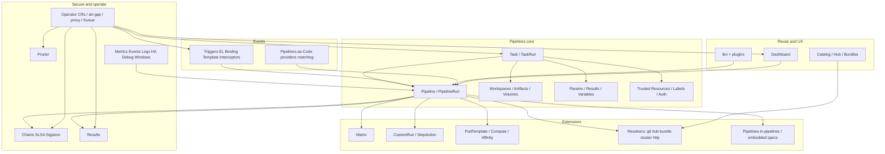

# 23 — Feature and offering coverage map

[← Previous](./22_Best_Practices_And_When_Not_Tekton.md) · [README](./README.md) · [Next: Catalog →](./24_YAML_CRD_Catalog_And_Troubleshooting.md)

---

## 1. Concepts

Final **product + configuration map** for Tekton. The ecosystem is Pipelines plus supporting projects. This track covers **every major offering class**; Hub Task encyclopedias, full OpenAPI dumps, and contributor guides stay upstream.

After this map you should be able to point at any tekton.dev/docs pillar (and major Pipelines/Triggers/PAC/Operator surfaces) and name the chapter that teaches it.

---

## 2. Advanced — full offering inventory

### A. Foundation and install

| Offering / config | Track |
|-------------------|-------|
| What Tekton is; CNCF; vs forge CI / Jenkins | [01](./01_What_Is_Tekton.md) |
| Pipelines release YAML install | [02](./02_Install_Pipelines_And_Operator.md) |
| Operator install path | [02](./02_Install_Pipelines_And_Operator.md), [19](./19_Operator_Platform_Config.md) |
| Additional Pipelines configuration / feature flags | [02](./02_Install_Pipelines_And_Operator.md), [20](./20_Observability_HA_Debug_And_Windows.md) |
| Air-gap / private registry mirrors | [02](./02_Install_Pipelines_And_Operator.md), [19](./19_Operator_Platform_Config.md) |
| Getting Started / first Run | [04](./04_First_Task_And_PipelineRun.md) |

### B. Core CRDs and authoring

| Offering / config | Track |
|-------------------|-------|
| Task / TaskRun | [03](./03_Core_Model_Tasks_Pipelines_Runs.md)–[05](./05_Tasks_Steps_Params_And_Results.md) |
| Pipeline / PipelineRun | [03](./03_Core_Model_Tasks_Pipelines_Runs.md), [06](./06_Pipelines_Ordering_And_Finally.md) |
| Steps, scripts, command/args | [05](./05_Tasks_Steps_Params_And_Results.md) |
| Params (string/array), variable substitution | [05](./05_Tasks_Steps_Params_And_Results.md) |
| Results (incl. larger-result literacy) | [05](./05_Tasks_Steps_Params_And_Results.md) |
| `when` / `onError` / timeouts / stream redirects / displayName | [05](./05_Tasks_Steps_Params_And_Results.md) |
| `stepTemplate` / sidecars | [05](./05_Tasks_Steps_Params_And_Results.md) |
| `runAfter` / `finally` / result passing | [06](./06_Pipelines_Ordering_And_Finally.md) |
| Pipelines-in-pipelines; embedded `taskSpec` / `pipelineSpec` | [06](./06_Pipelines_Ordering_And_Finally.md) |
| PipelineRun `taskRunSpecs` / timeouts / retries | [06](./06_Pipelines_Ordering_And_Finally.md) |
| Workspaces (optional, isolated) | [07](./07_Workspaces_Artifacts_And_Volumes.md) |
| Volume sources (emptyDir, PVC, ConfigMap, Secret, …) | [07](./07_Workspaces_Artifacts_And_Volumes.md) |
| Artifacts | [07](./07_Workspaces_Artifacts_And_Volumes.md) |
| Deprecated PipelineResources | [03](./03_Core_Model_Tasks_Pipelines_Runs.md), [25](./25_Migrate_Versioning_And_Extras.md) |

### C. Runtime shape and auth

| Offering / config | Track |
|-------------------|-------|
| ServiceAccount / RBAC / pull-push auth | [08](./08_Auth_ServiceAccounts_And_RBAC.md) |
| Trusted Resources | [08](./08_Auth_ServiceAccounts_And_RBAC.md) |
| Labels | [08](./08_Auth_ServiceAccounts_And_RBAC.md) |
| Hermetic / SPIRE literacy | [08](./08_Auth_ServiceAccounts_And_RBAC.md), [20](./20_Observability_HA_Debug_And_Windows.md) |
| Container contract literacy | [08](./08_Auth_ServiceAccounts_And_RBAC.md) |
| Threat-model literacy | [08](./08_Auth_ServiceAccounts_And_RBAC.md), [25](./25_Migrate_Versioning_And_Extras.md) |
| PodTemplate / nodeSelector / tolerations / securityContext | [09](./09_Pod_Templates_Compute_And_Affinity.md) |
| Compute resources | [09](./09_Pod_Templates_Compute_And_Affinity.md) |
| Affinity assistants | [09](./09_Pod_Templates_Compute_And_Affinity.md), [07](./07_Workspaces_Artifacts_And_Volumes.md) |
| Matrix | [10](./10_Matrix_CustomRuns_And_StepActions.md) |
| CustomRun / Custom Task | [10](./10_Matrix_CustomRuns_And_StepActions.md) |
| StepAction | [10](./10_Matrix_CustomRuns_And_StepActions.md) |
| Windows Tasks | [20](./20_Observability_HA_Debug_And_Windows.md) |

### D. Remote resolution and reuse

| Offering / config | Track |
|-------------------|-------|
| git resolver | [11](./11_Resolvers_Bundles_And_Remote_Resources.md) |
| hub resolver | [11](./11_Resolvers_Bundles_And_Remote_Resources.md), [14](./14_Catalog_Hub_And_Reusable_Tasks.md) |
| bundle resolver / OCI bundles / contracts | [11](./11_Resolvers_Bundles_And_Remote_Resources.md), [14](./14_Catalog_Hub_And_Reusable_Tasks.md) |
| cluster resolver | [11](./11_Resolvers_Bundles_And_Remote_Resources.md) |
| http resolver | [11](./11_Resolvers_Bundles_And_Remote_Resources.md) |
| Catalog | [14](./14_Catalog_Hub_And_Reusable_Tasks.md) |
| Hub | [14](./14_Catalog_Hub_And_Reusable_Tasks.md) |

### E. Triggers

| Offering / config | Track |
|-------------------|-------|
| EventListener | [12](./12_Triggers_EventListeners_And_Interceptors.md) |
| Trigger / TriggerBinding / ClusterTriggerBinding | [12](./12_Triggers_EventListeners_And_Interceptors.md) |
| TriggerTemplate | [12](./12_Triggers_EventListeners_And_Interceptors.md) |
| Interceptors / ClusterInterceptor / CEL | [12](./12_Triggers_EventListeners_And_Interceptors.md) |
| Triggers install / metrics / troubleshooting | [12](./12_Triggers_EventListeners_And_Interceptors.md), [20](./20_Observability_HA_Debug_And_Windows.md), [24](./24_YAML_CRD_Catalog_And_Troubleshooting.md) |

### F. Pipelines-as-Code

| Offering / config | Track |
|-------------------|-------|
| `.tekton/` PipelineRuns / annotations | [13](./13_Pipelines_As_Code.md) |
| Repository CR | [13](./13_Pipelines_As_Code.md) |
| Providers (GitHub App/Webhook, GitLab, Bitbucket, Forgejo, …) | [13](./13_Pipelines_As_Code.md) |
| Event matching (path, CEL, comments, skip-ci) | [13](./13_Pipelines_As_Code.md) |
| Concurrency / token scoping / certificates | [13](./13_Pipelines_As_Code.md) |
| Ops (metrics, tracing, multi-controller) | [13](./13_Pipelines_As_Code.md) |
| Remote pipelines resolution | [13](./13_Pipelines_As_Code.md), [11](./11_Resolvers_Bundles_And_Remote_Resources.md) |
| Gitops comment commands / LLM guides | [13](./13_Pipelines_As_Code.md), [25](./25_Migrate_Versioning_And_Extras.md) — optional |
| PAC CLI helpers | [13](./13_Pipelines_As_Code.md), [15](./15_CLI_tkn.md) |

### G. CLI and Dashboard

| Offering / config | Track |
|-------------------|-------|
| `tkn` (list/start/logs/describe) | [15](./15_CLI_tkn.md) |
| `tkn` plugins (hub/PAC) | [15](./15_CLI_tkn.md) |
| Dashboard UI | [16](./16_Dashboard.md) |

### H. Chains (supply chain)

| Offering / config | Track |
|-------------------|-------|
| Signing | [17](./17_Chains_Supply_Chain_Security.md) |
| SLSA provenance / predicates | [17](./17_Chains_Supply_Chain_Security.md) |
| Sigstore / Fulcio / Rekor literacy | [17](./17_Chains_Supply_Chain_Security.md) |
| OCI encoding / attestation storage | [17](./17_Chains_Supply_Chain_Security.md) |
| Chains config / metrics / performance | [17](./17_Chains_Supply_Chain_Security.md), [19](./19_Operator_Platform_Config.md) |

### I. Results and Pruner

| Offering / config | Track |
|-------------------|-------|
| Results API / storage / watcher literacy | [18](./18_Results_And_Pruner.md) |
| External DB / scaling / retention agent | [18](./18_Results_And_Pruner.md), [25](./25_Migrate_Versioning_And_Extras.md) |
| Pruner policies | [18](./18_Results_And_Pruner.md) |

### J. Operator and platform

| Offering / config | Track |
|-------------------|-------|
| TektonConfig / TektonOperator | [19](./19_Operator_Platform_Config.md) |
| TektonPipeline / Trigger / Dashboard / Chain / Result / Pruner CRs | [19](./19_Operator_Platform_Config.md) |
| TektonAddon / PAC via Operator | [19](./19_Operator_Platform_Config.md), [13](./13_Pipelines_As_Code.md) |
| TektonKueue / TektonScheduler | [19](./19_Operator_Platform_Config.md) |
| ManualApprovalGate | [19](./19_Operator_Platform_Config.md) |
| NetworkPolicy / Proxy / AirGapImageConfiguration | [19](./19_Operator_Platform_Config.md) |
| OpenShift SCC / TLS / PAC | [19](./19_Operator_Platform_Config.md) |
| Syncer / multicluster proxy literacy | [19](./19_Operator_Platform_Config.md) |

### K. Observability and ops

| Offering / config | Track |
|-------------------|-------|
| Metrics (OTel migration) | [20](./20_Observability_HA_Debug_And_Windows.md) |
| Events | [20](./20_Observability_HA_Debug_And_Windows.md) |
| Logs | [20](./20_Observability_HA_Debug_And_Windows.md) |
| Debug / breakpoints | [20](./20_Observability_HA_Debug_And_Windows.md) |
| Enabling HA | [20](./20_Observability_HA_Debug_And_Windows.md) |
| Controller performance flags | [20](./20_Observability_HA_Debug_And_Windows.md) |
| Agents literacy | [20](./20_Observability_HA_Debug_And_Windows.md) |
| Windows | [20](./20_Observability_HA_Debug_And_Windows.md) |

### L. Craft and spectrum

| Offering | Track |
|----------|-------|
| Worked lab (clone/build/push) | [21](./21_Worked_Example_Build_Test_Push.md) |
| How-to guide shapes | [21](./21_Worked_Example_Build_Test_Push.md) + upstream cookbooks |
| Best practices / when not | [22](./22_Best_Practices_And_When_Not_Tekton.md) |
| YAML/CRD troubleshooting | [24](./24_YAML_CRD_Catalog_And_Troubleshooting.md) |
| API migrations v1alpha1→v1beta1→v1 | [25](./25_Migrate_Versioning_And_Extras.md) |
| GitOps handoff; forge/Jenkins spectrum | [26](./26_GitOps_Handoff_And_Spectrum.md) |

### M. Official docs menu → track

| tekton.dev/docs area | Track |
|----------------------|-------|
| Getting started / Concepts / Installation | [01](./01_What_Is_Tekton.md)–[04](./04_First_Task_And_PipelineRun.md) |
| How-to Guides | [21](./21_Worked_Example_Build_Test_Push.md) + upstream |
| Tasks and Pipelines | [03](./03_Core_Model_Tasks_Pipelines_Runs.md)–[11](./11_Resolvers_Bundles_And_Remote_Resources.md), [20](./20_Observability_HA_Debug_And_Windows.md) |
| Triggers | [12](./12_Triggers_EventListeners_And_Interceptors.md) |
| Pipelines-as-Code | [13](./13_Pipelines_As_Code.md) |
| CLI / Dashboard / Catalog | [14](./14_Catalog_Hub_And_Reusable_Tasks.md)–[16](./16_Dashboard.md) |
| Chains (supply chain) | [17](./17_Chains_Supply_Chain_Security.md) |
| Results / Pruner | [18](./18_Results_And_Pruner.md) |
| Operator | [19](./19_Operator_Platform_Config.md) |
| Contribute / developer | Upstream |

### N. Hardening, UX, and platform edges (final pass)

| Offering / config | Track |
|-------------------|-------|
| Dashboard OAuth2 Proxy / SSO front door | [16](./16_Dashboard.md) |
| Dashboard extensions / logs UX | [16](./16_Dashboard.md) |
| Results summary / aggregation API | [18](./18_Results_And_Pruner.md) |
| Results watcher / retention agent / external DB | [18](./18_Results_And_Pruner.md) |
| Chains SLSA predicate generations (incl. v2 literacy) | [17](./17_Chains_Supply_Chain_Security.md) |
| `tkn` Triggers/CustomRun/bundle/hub families | [15](./15_CLI_tkn.md) |
| PAC statuses, skip-ci, tracing/profiling/informer-cache | [13](./13_Pipelines_As_Code.md), [20](./20_Observability_HA_Debug_And_Windows.md) |
| OpenShift centralized TLS / OpenShift PAC Operator | [19](./19_Operator_Platform_Config.md) |
| FIPS literacy (component build) | [08](./08_Auth_ServiceAccounts_And_RBAC.md), [20](./20_Observability_HA_Debug_And_Windows.md) |
| MLOps / classical / assisted spectrum doors | [22](./22_Best_Practices_And_When_Not_Tekton.md), [26](./26_GitOps_Handoff_And_Spectrum.md) |
| Containerization (cluster internals) door | [01](./01_What_Is_Tekton.md), [20](./20_Observability_HA_Debug_And_Windows.md) |

### O. Intentionally upstream

| Surface | Why |
|---------|-----|
| Every Task/Pipeline on Hub/Catalog | Pin and read what you install |
| Full CRD OpenAPI / generated API reference | Generated; version-specific |
| Every `tkn` subcommand man page | CLI reference upstream |
| Distro-only click-paths | OpenShift Pipelines admin encyclopedias |
| Contributor / experimental / MCP servers | Not operator CI surface |
| Website contribute / blog / run-locally authoring | Contributor path |
| Dashboard localization / installer internals | Upstream |
| Central TLS *test plans* | Distro QA docs |

---

## 3. Applications and use cases

Walk **A–L** for your platform: **use / later / N/A**. Production gaps in auth (C), prune/Results (I), and Chains (H) beat collecting more Hub Tasks.

---

## References

- [Tekton docs](https://tekton.dev/docs/)  
- [Pipelines](https://tekton.dev/docs/pipelines/)  
- [Triggers](https://tekton.dev/docs/triggers/)  
- [Pipelines-as-Code](https://tekton.dev/docs/pipelines-as-code/)  
- [Chains](https://tekton.dev/docs/chains/)  
- [Operator](https://tekton.dev/docs/operator/)  
- [Results](https://tekton.dev/docs/results/)  
- [Pruner](https://tekton.dev/docs/pruner/)  
