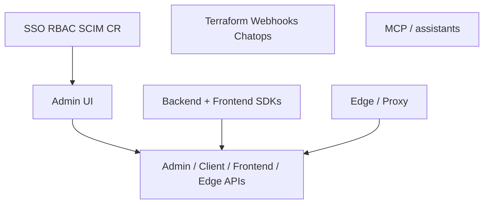

# 21 — Feature and offering coverage map

[← Previous](./20_Best_Practices_And_When_Not_Unleash.md) · [README](./README.md) · [Next: Catalog & spectrum →](./22_Config_Catalog_Migrate_And_Spectrum.md)

## 1. Concepts

Inventory of **offering classes** Unleash documents → this track. Use it in reviews: every major surface should map to a chapter.

## 2. Advanced concepts

### A. Core product

| Offering | Track |
|----------|-------|
| Feature flags / types / lifecycle / stale / archive / dependencies / tags / unknown flags | [01](./01_What_Is_Unleash_And_Feature_Flags.md), [06](./06_Feature_Flags_Variants_And_Strategy_Variants.md) |
| Projects / environments / applications | [05](./05_Projects_Environments_And_Applications.md) |
| Activation strategies / stickiness / custom | [07](./07_Activation_Strategies_Stickiness_And_Custom.md) |
| Context / constraints / segments | [08](./08_Context_Constraints_And_Segments.md) |
| Strategy variants / A/B | [06](./06_Feature_Flags_Variants_And_Strategy_Variants.md) |

### B. Architecture and clients

| Offering | Track |
|----------|-------|
| Server / Admin UI / evaluation model | [02](./02_Architecture_Server_SDK_Edge_And_APIs.md) |
| Admin / Client / Frontend / Edge APIs (every endpoint) | [02](./02_Architecture_Server_SDK_Edge_And_APIs.md), [23](./23_Admin_Client_Frontend_And_Edge_APIs.md) |
| Backend vs frontend SDKs / OpenFeature / **every official method family** | [09](./09_SDKs_Backend_Frontend_And_OpenFeature.md) |
| Edge, Proxy migration, streaming | [10](./10_Edge_Proxy_And_Streaming.md) |
| Backend / frontend / PAT / service-account tokens (admin tokens deprecated) | [11](./11_API_Tokens_Keys_And_Service_Accounts.md) |

### C. Deploy and operate

| Offering | Track |
|----------|-------|
| Hosting / Docker / Cloud / **hybrid** / HTTPS / config / license keys | [03](./03_Install_Hosting_And_Configuration.md) |
| Scale / upgrade / sync / **resource limits** / Network / maintenance / banners | [18](./18_Scale_Upgrade_Operate_And_Troubleshoot.md) |
| First loop / gradual rollout lab | [04](./04_First_Flag_SDK_And_Toggle_Loop.md), [19](./19_Worked_Example_Gradual_Rollout_In_CI_CD.md) |

### D. Identity and governance

| Offering | Track |
|----------|-------|
| SSO / RBAC / SCIM / provisioning | [12](./12_SSO_RBAC_SCIM_And_Provisioning.md) |
| Change requests / release templates / signals / actions | [13](./13_Change_Requests_Release_Management_And_Governance.md) |
| Impression / insights / impact / playground / **events** | [14](./14_Impression_Analytics_Impact_And_Playground.md) |

### E. Integrate, AI, compliance

| Offering | Track |
|----------|-------|
| Terraform / webhooks / Slack / Jira / Datadog / toolbar / **GitHub Action** | [15](./15_Integrations_Terraform_Webhooks_And_Chatops.md) |
| MCP / coding assistants / AI feature flags | [16](./16_AI_Assistants_MCP_And_Assisted_Delivery.md) |
| Privacy / SOC2 / ISO / FedRAMP / **CORS / IP allow lists** | [17](./17_Security_Privacy_And_Compliance.md) |
| Judgment / debt / when not | [20](./20_Best_Practices_And_When_Not_Unleash.md) |
| Migrate / OSS vs Ent / spectrum doors | [22](./22_Config_Catalog_Migrate_And_Spectrum.md) |

### F. Intentionally upstream

| Surface | Why |
|---------|-----|
| Per-language **install/version-pin** pages and copy-paste Hello World | Pin the SDK you ship; methods themselves are in [09](./09_SDKs_Backend_Frontend_And_OpenFeature.md) |
| Language-specific **tutorial** encyclopedias (SvelteKit, Spring Boot, Lambda, …) | Guides; model + methods in [09](./09_SDKs_Backend_Frontend_And_OpenFeature.md) |
| Community SDKs and **Android Proxy-legacy** client | Unofficial or deprecated; official list is [09](./09_SDKs_Backend_Frontend_And_OpenFeature.md) |
| Edge **CLI/env-var encyclopedia** (every `--flag`) | Operator knobs drift; topology in [10](./10_Edge_Proxy_And_Streaming.md), configure guide upstream |
| SSO IdP **click-by-click** (Okta/Keycloak/Entra screenshots) | Literacy in [12](./12_SSO_RBAC_SCIM_And_Provisioning.md); recipes upstream |
| Learning Lab marketing / certificates | Optional training UX |
| Contribute / Fern internals / ADRs | Contributor path |
| Enterprise-only click-path encyclopedias | Edition + vendor UI drift |
| Request/response **JSON schemas** and generated examples | Drift every minor; **operation list** is [23](./23_Admin_Client_Frontend_And_Edge_APIs.md) |
| Release-notes changelog every date | Version log upstream; offering classes stay in this track |
| MCP per-IDE install snippets | Surfaces named in [16](./16_AI_Assistants_MCP_And_Assisted_Delivery.md) |

### G. Live scrape harden (docs.getunleash.io index)

| Offering / config | Track |
|-------------------|-------|
| Flag expected lifetimes; stale; Define→Archived lifecycle | [01](./01_What_Is_Unleash_And_Feature_Flags.md), [06](./06_Feature_Flags_Variants_And_Strategy_Variants.md) |
| Dependencies, naming regex, tags, links, unknown flags | [06](./06_Feature_Flags_Variants_And_Strategy_Variants.md) |
| Cloud / hybrid / self-host + Edge Cloud | [03](./03_Install_Hosting_And_Configuration.md), [10](./10_Edge_Proxy_And_Streaming.md) |
| Frontend API context-on-wire vs Edge | [02](./02_Architecture_Server_SDK_Edge_And_APIs.md) |
| Backend vs frontend vs PAT vs service account; admin token deprecated | [11](./11_API_Tokens_Keys_And_Service_Accounts.md) |
| Event Log / Timeline | [14](./14_Impression_Analytics_Impact_And_Playground.md) |
| Resource limits; import/export; Network; maintenance; banners; command menu | [18](./18_Scale_Upgrade_Operate_And_Troubleshoot.md) |
| CORS + IP allow lists | [17](./17_Security_Privacy_And_Compliance.md) |
| GitHub Action flag evaluation in CI | [15](./15_Integrations_Terraform_Webhooks_And_Chatops.md) |
| Access requests | [12](./12_SSO_RBAC_SCIM_And_Provisioning.md) |
| Every official SDK method family (backend + frontend + OpenFeature) | [09](./09_SDKs_Backend_Frontend_And_OpenFeature.md) |
| Every Client / Frontend / Edge / Admin HTTP operation (OpenAPI v8.0.3; 5+4+14+376) | [23](./23_Admin_Client_Frontend_And_Edge_APIs.md) |
| Plans / BETA / independent semver (server vs Edge vs SDK); AGPLv3 from v8 | [22](./22_Config_Catalog_Migrate_And_Spectrum.md) |
| Admin search / filters / favorites | [18](./18_Scale_Upgrade_Operate_And_Troubleshoot.md) |
| Sunset flag type | [01](./01_What_Is_Unleash_And_Feature_Flags.md) |

## 3. Applications and use cases

Walk **A–E** plus **G** for your estate: **use / later / N/A**. Gaps in tokens (B), governance (D), and Edge (B) beat collecting more SDK languages. SDK **methods** are [09](./09_SDKs_Backend_Frontend_And_OpenFeature.md); HTTP **endpoints** are [23](./23_Admin_Client_Frontend_And_Edge_APIs.md). **F** is schemas, tutorials, and marketing — not the method/endpoint lists.

**Staff checklist**

- Coverage map reviewed at platform design time  
- Upstream exceptions understood (F)  

**Good:** every prod surface has a chapter owner. **Bad:** “we use Unleash” with no Edge/token/CR story.

## References

- [Docs home](https://docs.getunleash.io/)  
- [Concepts](https://docs.getunleash.io/concepts)  
- [OSS comparison](https://docs.getunleash.io/support/oss-comparison)  
