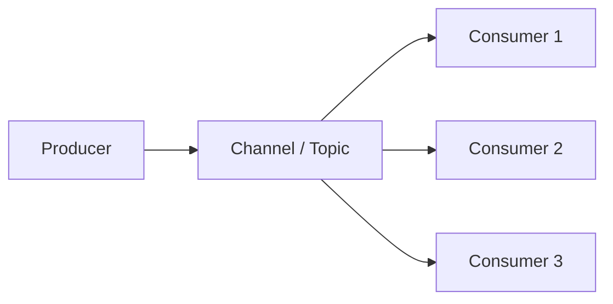

# Event-Driven Architecture (EDA)

## What it is

**Event-driven architecture** is a design where **components communicate via events**: something happens (e.g. "Order placed", "Payment completed"), and **producers** emit events that **consumers** react to. Components are **loosely coupled**; producers do not call consumers directly.

## Why we need it

- **Decoupling** — Producers and consumers can evolve and scale independently; no tight API coupling.
- **Flexibility** — New consumers can subscribe to existing events without changing producers.
- **Async** — Work is done asynchronously; producers don't wait for all consumers.
- **Use case:** Microservices, real-time pipelines, audit, analytics, and workflows that react to business events.

## How it works

1. **Producer** (or publisher) emits an **event** to a **channel** (topic, stream, or queue).
2. **Consumers** (or subscribers) receive the event and perform their logic (update DB, send notification, update search index).
3. Communication is **asynchronous**; the producer does not wait for consumer completion.

Components: **Event** (what happened), **Producer**, **Channel** (topic/queue/stream), **Consumer**. Often implemented with message queues or event streams. See [Message queues](../Messaging/1_Message_Queues.md), [Types of message queues](../Messaging/6_Types_of_Message_Queues.md), [Queues vs streams](../Messaging/4_Queues_vs_Streams.md).

## Event-driven vs message-driven

- **Message-driven** — Focus on **messages** (tasks, commands, requests); consumer processes a unit of work. Often point-to-point.
- **Event-driven** — Focus on **events** (something happened); consumers react. Often pub/sub or stream. Overlap is large; "event-driven" usually implies pub/sub and multiple consumers reacting to the same event.

## Trade-offs

- **Advantages:** Loose coupling, scalability, ability to add consumers without changing producers.
- **Disadvantages:** Eventual consistency, debugging and ordering across services, need for idempotency and dead-letter handling.

**When to use:** When multiple parts of the system must react to the same occurrence (e.g. order placed → inventory, email, analytics) and you want to avoid tight coupling. See [Event sourcing](1_Event_Sourcing.md) for storing state as events.
