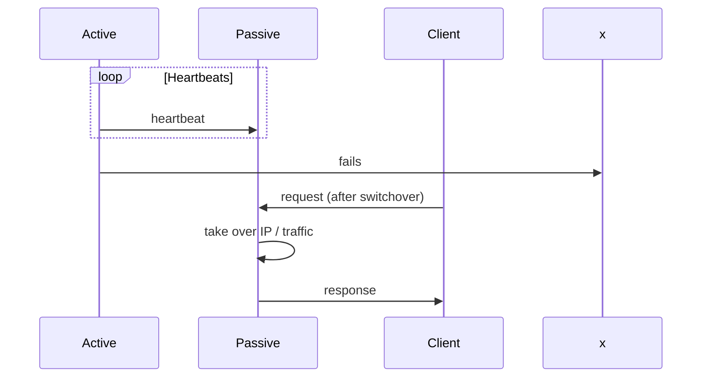

# Failover

## What it is

**Failover** is an availability pattern that keeps the system running when a component fails. There is a **primary** (active) that handles requests and a **secondary** (standby) that can take over. In **active-passive**, only the primary serves traffic; in **active-active**, both serve traffic and share the load.

The diagrams below show the two common setups: one active with a standby (active-passive), and two actives sharing traffic (active-active).

  

---

## Why we need it

To avoid a **single point of failure**: if the primary is the only one serving traffic, its failure means full outage. Failover provides a **standby** that can take over so availability is maintained (at the cost of extra hardware and complexity).

---

## How it works (flow)

1. **Primary** serves traffic; **secondary** is on standby (or also serving, in active-active).
2. **Monitoring** detects failure (e.g. **heartbeats** between active and passive; if the heartbeat stops, the passive assumes the active is down).
3. **Switchover**: secondary takes over the primary’s role (e.g. takes its IP address or traffic is routed to it).
4. Service **resumes**; downtime is the time to detect failure and complete switchover.

---

## Active-passive

- **Only the active server** handles traffic. The **passive** server is on standby (idle or in “hot” standby, already running).
- **Heartbeats** are sent between active and passive. If the heartbeat is interrupted, the **passive takes over** the active’s IP address (or traffic is switched to it) and resumes service.
- **Downtime** depends on whether the passive is **hot** (already up, faster) or **cold** (must start first, longer).
- Also called **master–slave** failover.

---

## Active-active

- **Both servers** handle traffic; load is spread between them.
- If they are **public-facing**, DNS or the load balancer must know both servers’ IPs. If **internal**, the application or service mesh must know both and route to them.
- Also called **master–master** failover.
- **Benefit**: better resource use and often **faster** failover (one node just takes more traffic when the other fails).

---

## Disadvantages of failover

- **More hardware and complexity** — Two (or more) nodes to deploy, monitor, and keep in sync.
- **Risk of data loss** — If the active fails **before** newly written data has been replicated to the passive, that data can be lost. Replication lag directly affects how much you might lose.

---

## When to use

Use failover when you need **high availability** for a critical component and can afford a standby (or second active) node. Prefer **active-active** when you want better utilization and faster failover; use **active-passive** when you want a clear single writer and simpler conflict handling. Always pair with **replication** (see [Replication](3-replication.md)) so the standby has up-to-date (or acceptable) data.
