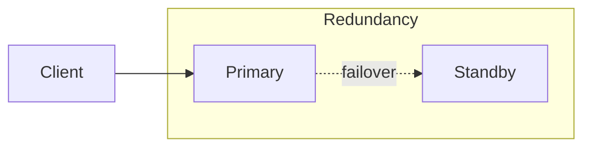

# Fault Tolerance in System Design

## What it is

**Fault tolerance** is the ability of a system to **continue operating** (or degrade gracefully) when one or more components **fail**. Failures include hardware faults, software crashes, network partitions, and overload.

## Why we need it

- **Availability** — Users expect the system to stay up despite failures.
- **Reliability** — The system should deliver correct results and recover from transient failures without data loss (where required by design).

## How to achieve it

- **Redundancy** — Multiple instances of critical components (servers, DB replicas, queues) so one failure does not take down the service. See [Availability patterns](1-availability-patterns.md).
- **Failover** — Standby takes over when primary fails. See [Failover](2-failover.md).
- **Replication** — Data and sometimes compute replicated across nodes; if one node fails, others can serve. See [Replication](3-replication.md).
- **Health checks and removal** — Load balancers or orchestrators stop sending traffic to unhealthy instances.
- **Circuit breakers** — Stop calling a failing dependency so the rest of the system can stay up. See [Circuit breaker](../patterns/4-circuit-breaker.md).
- **Graceful degradation** — Disable non-critical features when a dependency fails; keep core functionality.
- **Idempotency and retries** — Retry transient failures; design so duplicate requests are safe. See [Idempotency](../consistency/4-idempotency.md).

## Trade-offs

- **Cost** — Redundancy and standby nodes cost more.
- **Complexity** — Failure detection, failover, and consistency across replicas add operational and design complexity.

**When to use:** Design for fault tolerance for any production system; level of redundancy and failover depends on availability targets (e.g. nines). See [Availability in numbers](4-availability-in-numbers.md).
