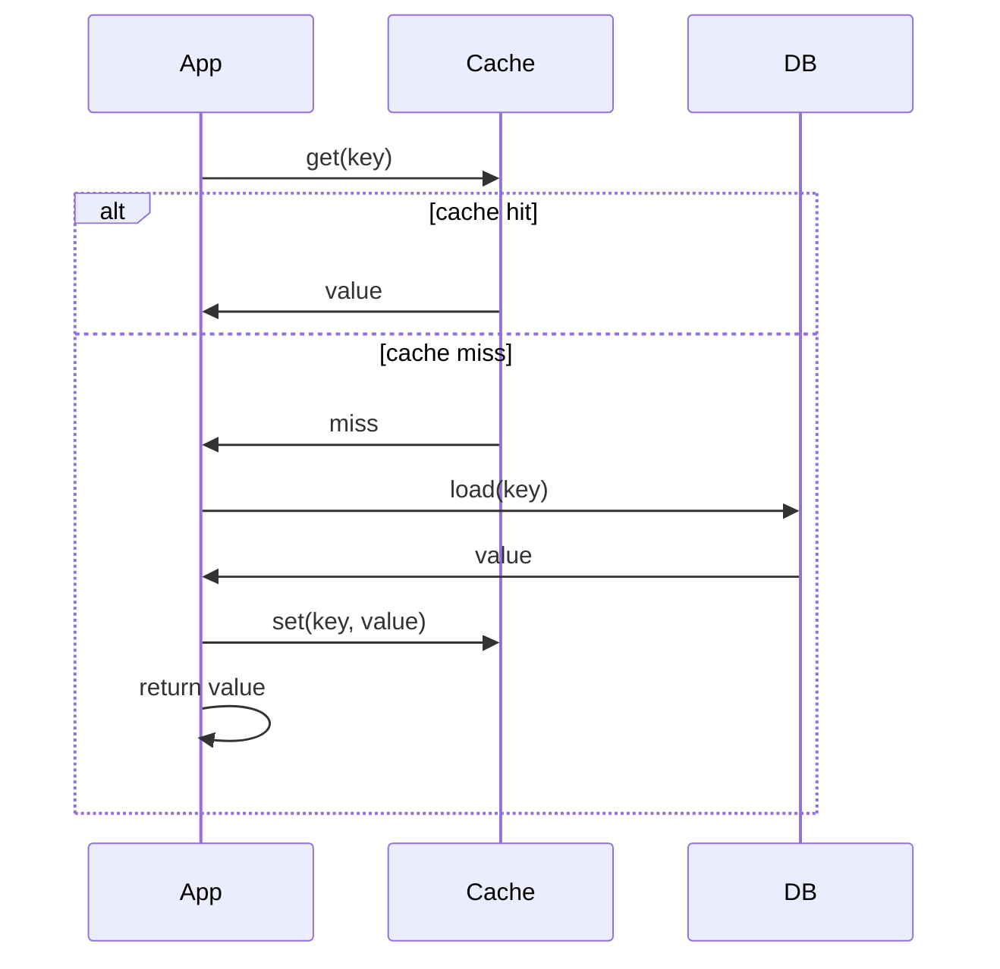

# Cache-Aside

## What it is

**Cache-aside** (also called **lazy loading**) means the **application** is responsible for both the cache and the backing store. The cache does **not** talk to the store; the application reads from or writes to each as needed. Only data that is **actually requested** gets loaded into the cache.

---

## Why we need it

- **Avoid loading unused data** — The cache only holds what was requested (or written), so you don’t fill it with cold data.
- **Flexibility** — Cache and store can be different technologies (e.g. Redis + PostgreSQL).
- **Control** — Application decides exactly when to invalidate or update the cache on writes.

---

## How it works (flow)

The flow is usually presented in the sources as follows.

### Read path

1. **Look up** the key in the cache.
2. **On hit** → return the value.
3. **On miss** → **load** from the database, **put** the value into the cache, then **return** it. Subsequent reads for that key are fast (cache hit).

### Write path

- Application **writes to the database** (update or delete).
- Then it **invalidates** (or updates) the cache for that key — e.g. **delete** the key so the next read does a miss and repopulates from the DB. Alternatively, the app can **update** the cache with the new value so the next read is a hit.

So the **flow of thought**: read → check cache → on miss, load from DB and fill cache → return. Write → update DB → invalidate/update cache.

---

## Advantages

- Only **requested** data is cached (lazy loading); cache stays focused on **hot** data.
- **Cache and store** can be different systems; you’re not tied to a built-in cache layer.
- **Stale reads** are limited to the window between write and invalidation (or you update the cache on write).

## Disadvantages

- **Cache miss** on first request (or after invalidation) adds **latency** (one DB read + one cache write).
- **Staleness** — If you only invalidate on write, a concurrent reader might repopulate the cache with **old** data before the writer’s DB update is visible. Careful ordering (e.g. invalidate after DB commit) or versioned keys can help.
- **Thundering herd** — Many requests for the same missing key can all hit the DB; use locking or “request coalescing” so only one loader runs.

---

## When to use

General-purpose pattern when the **application** should control what is cached and when it’s updated. Common with **Memcached** or **Redis** in front of a database. Use when you want **lazy** population and explicit invalidation; combine with TTL to avoid holding stale data forever. See [Caching overview](1-caching-overview.md) and [Cache layers](6-cache-layers.md).
