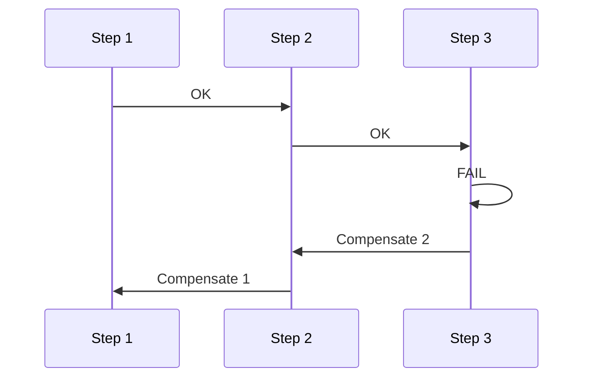

# Compensating Transactions

## What they are

A **compensating transaction** is an operation that **undoes or reverses** the effect of a previous operation in a distributed or multi-step workflow when a later step **fails**. It restores consistency by applying the **inverse** of what was done (e.g. refund after a failed shipment, release inventory after payment failure), rather than using a single distributed transaction (2PC) across all services.

## Why we need them

- **Distributed systems** — Cross-service workflows often cannot use a single ACID transaction; one service may commit and another then fails.
- **Consistency** — Without compensation, partial success leaves the system in an inconsistent state (e.g. money deducted but order not placed).
- **Sagas** — In the **saga** pattern, each step has a **compensating action**; if step N fails, steps 1..N-1 are undone in reverse order by running their compensations.

## How they work

1. **Forward steps** — Execute each step of the workflow; each step may commit locally.
2. **On failure** — Identify which steps already completed and run their **compensating transactions** in reverse order.
3. **Compensation** — Each compensation is application-defined (e.g. "cancel reservation", "refund payment"); it does not have to be a literal "undo" of the original write, but should bring the system back to a consistent, acceptable state.

## Trade-offs

- **Advantages:** Avoids distributed locks and 2PC; allows autonomous services and eventual consistency.
- **Disadvantages:** Compensations can fail (need retries and monitoring); business logic must define and maintain compensations; temporary inconsistency is visible.

**When to use:** Use compensating transactions (and the saga pattern) when you have **multi-step, cross-service** workflows and cannot use a single distributed transaction. Design each step with a clear compensation and idempotency. See [Idempotency](4-idempotency.md) and [Consistency patterns](3-consistency-patterns.md).
