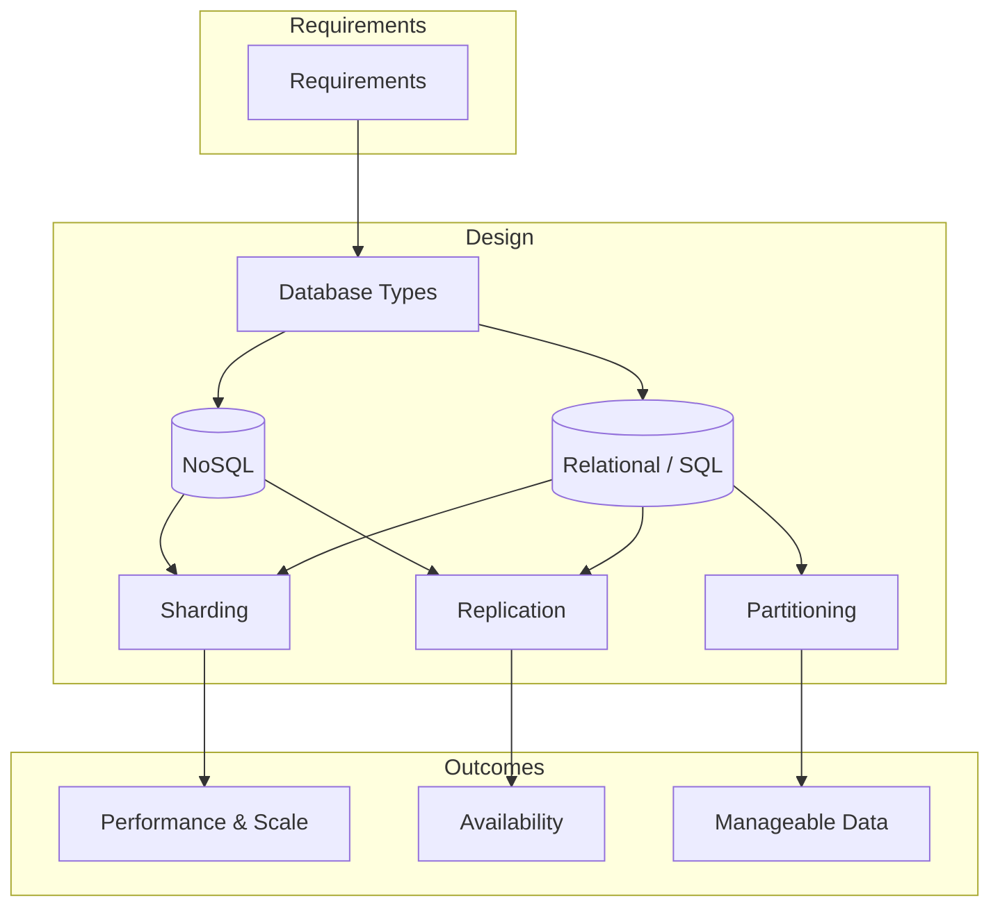

# Database Design Overview

## Table of Contents

  - [What is a Database?](#what-is-a-database)
  - [Terminologies Used in the Database](#terminologies-used-in-the-database)
  - [Types of Databases](#types-of-databases)
  - [Use cases by type](#use-cases-by-type-why-you-use-each)
  - [Importance of Database Design in System Design](#importance-of-database-design-in-system-design)
  - [Database Patterns](#database-patterns)

### What is a Database?

A database is an organized collection of data that is stored and managed so that it can be easily accessed, updated, and retrieved when needed. A database helps store large amounts of data in a structured and efficient way. It's used in various applications, from websites and mobile apps to enterprise systems. Think of it as a digital filing cabinet where information is systematically arranged to make it easy to find and use.

### Terminologies Used in the Database

- **Data**: Any statistics which is raw and unprocessed are referred to as Data
- **Information**: When data is processed, it is known as Information. This is because information gives an idea about what the data is about and how to use it further
- **Database Management System (DBMS)**: A system developed to add, edit, and manage various databases in a collection is known as DBMS
- **Transactions**: Any CRUD operation performed on a database is called a Transaction in the Database

### Types of Databases

This section uses a **10-type taxonomy** shared across the system design and database deep-dive content. The table below summarizes; **use cases by type** follow so you can see why you’d pick each. The [README](README.md#database-types--use-cases) has the same taxonomy with more detail and deep-dive links.

| # | Type | One-line use case | Examples |
|---|------|-------------------|----------|
| 1 | **Relational** | Transactions, ACID, complex SQL, reporting | MySQL, PostgreSQL, Oracle, SQLite |
| 2 | **Document Store** | Flexible schema, document-centric data | MongoDB, CouchDB |
| 3 | **Key-Value** | Fast lookups by key, high throughput | Redis, DynamoDB, Aerospike |
| 4 | **Wide-Column** | Massive reads/writes, large partitions | Cassandra, HBase, ScyllaDB |
| 5 | **Graph** | Relationships, traversals, recommendations | Neo4j, Neptune, ArangoDB |
| 6 | **Time-Series** | Timestamped data, metrics, IoT | InfluxDB, TimescaleDB, Prometheus |
| 7 | **Search Engine** | Full-text search, facets, log analytics | Elasticsearch, Solr, Meilisearch |
| 8 | **In-Memory Cache** | Sub-ms latency, offload DB, sessions | Redis, Memcached, Hazelcast |
| 9 | **Blob/Object Storage** | Files, media, backups, data lakes | S3, GCS, MinIO, Azure Blob |
| 10 | **Vector** | Similarity search, semantic search, RAG | Pinecone, Weaviate, Milvus |

**Traditional grouping:** Type 1 is **SQL/relational**. Types 2–8 are often called **NoSQL**. Types 9–10 are **storage and AI-oriented** (object storage, vector DBs).

#### Use cases by type (why you use each)

1. **Relational** — Transactional applications (banking, e-commerce, inventory); structured reporting and dashboards; complex queries with joins; data integrity and referential constraints; legacy/enterprise systems. *SQLite:* embedded, single-file, or local-first apps (mobile, edge).
2. **Document Store** — Flexible or evolving schemas; document-centric workloads (catalogs, content, configs); rapid iteration without migrations; horizontal scaling; semi-structured data (forms, API payloads).
3. **Key-Value** — Fast lookups by key (sessions, preferences, feature flags); high throughput and simple get/put; leaderboards, counters, rate limiters; serverless/auto-scaling (e.g. DynamoDB).
4. **Wide-Column** — Massive write throughput (events, IoT, clickstreams); very large partitions; multi-datacenter replication; sparse columns; no single point of failure, linear scale-out.
5. **Graph** — Relationship-heavy data (social, followers); recommendations and “similar to”; fraud/identity and connected-account analysis; knowledge graphs; network/dependency analysis.
6. **Time-Series** — Metrics and monitoring; IoT/sensor telemetry; financial tick data; event streams and audits; efficient retention, downsampling, and time-range aggregation.
7. **Search Engine** — Full-text and fuzzy search; faceted search and autocomplete; log and security analytics (SIEM); relevance tuning and highlighting.
8. **In-Memory Cache** — Reduce latency and load on primary store; cache DB/API results; session and short-lived state; rate limiting and counters; pub/sub and lightweight queues.
9. **Blob/Object Storage** — Media and static assets; backups and archives; data lakes; unstructured data at scale; high durability and optional versioning.
10. **Vector** — Semantic search (by meaning, not just keywords); RAG and AI retrieval; “similar items”/recommendations; deduplication and clustering; image/audio similarity.

### Importance of Database Design in System Design

Good database design is important in system design because it ensures that the system can handle data efficiently, reliably, and at scale. Let us see its importance:

- **Performance**: A well-designed database processes data quickly, which means faster responses for users and smoother system operations
- **Scalability**: As the system grows, a good database design can handle more users and data without slowing down or failing
- **Data Integrity**: Proper design prevents duplicate, inconsistent, or incorrect data, ensuring the system works accurately
- **Ease of Maintenance**: A clean, logical database structure is easier to understand and update, saving time and effort when making changes or fixing issues
- **Cost-Efficiency**: Optimized database designs use resources efficiently, reducing server costs and improving overall system performance
- **Security**: Good design includes measures to protect sensitive data from unauthorized access

The diagram below summarizes how database design fits into system design: requirements drive the choice of database type and patterns (sharding, replication, etc.).

*Concept adapted from GeeksforGeeks: [Complete Guide to Database Design - System Design](https://www.geeksforgeeks.org/system-design/complete-reference-to-databases-in-designing-systems/).*

### Database Patterns

Database patterns are established solutions or best practices to address common challenges in managing databases. They help improve performance, scalability, reliability, and maintainability in large or complex systems.

#### 1. Data Sharding

Sharding is the practice of splitting a large dataset into smaller, more manageable pieces, called shards. Each shard is stored on a separate server or machine. This helps distribute the data and workload, improving scalability and performance.

Sharding is especially useful when a database becomes too large to fit on a single machine or when the traffic load is too high for one server to handle. It helps distribute the load across multiple servers.

#### 2. Data Partitioning

Partitioning involves dividing a large dataset into smaller parts (partitions), but unlike sharding, the partitions are usually stored within the same database or server. Partitioning can be done in various ways, such as by range (splitting data based on ranges of values) or list (grouping data by specific categories).

Partitioning helps improve query performance by limiting the amount of data the system has to process for specific queries. It also makes it easier to manage large datasets.

#### 3. Master-Slave Replication

In master-slave replication, the master database handles all write operations (e.g., inserts, updates), while slave databases replicate the data from the master and handle read operations (e.g., selects). This helps distribute the workload, especially for read-heavy applications.

It improves performance by offloading read queries from the master database, which can focus on handling write operations. It also provides redundancy in case the master fails, as the slave can be promoted to the master.

#### 4. CQRS (Command Query Responsibility Segregation)

CQRS involves separating the commands (write operations) from the queries (read operations) into two distinct models. This allows you to optimize each part for its specific workload. Command models focus on handling updates, while query models focus on providing fast read operations.

It allows for optimized performance for both reading and writing operations. It can help scale a system more efficiently by providing different models for handling reads and writes.

#### 5. Database Normalization

Normalization is the process of organizing data to reduce redundancy and dependency by splitting data into multiple related tables. Each table should focus on a specific entity or concept to ensure data integrity and avoid inconsistencies.

Normalization helps maintain data consistency, reduces storage space, and makes it easier to manage the database.

#### 6. Data Consistency Patterns

These patterns help ensure that the data across multiple databases or servers remains consistent, especially in distributed systems. Ensures that the data across distributed systems remains reliable and accurate, even in the face of network failures or other issues.

---

**Reference**: [Complete Guide to Database Design - System Design](https://www.geeksforgeeks.org/system-design/complete-reference-to-databases-in-designing-systems/)

**Previous**: [README](README.md) | **Next**: [SQL vs NoSQL Selection](2-sql-vs-nosql-selection.md)

