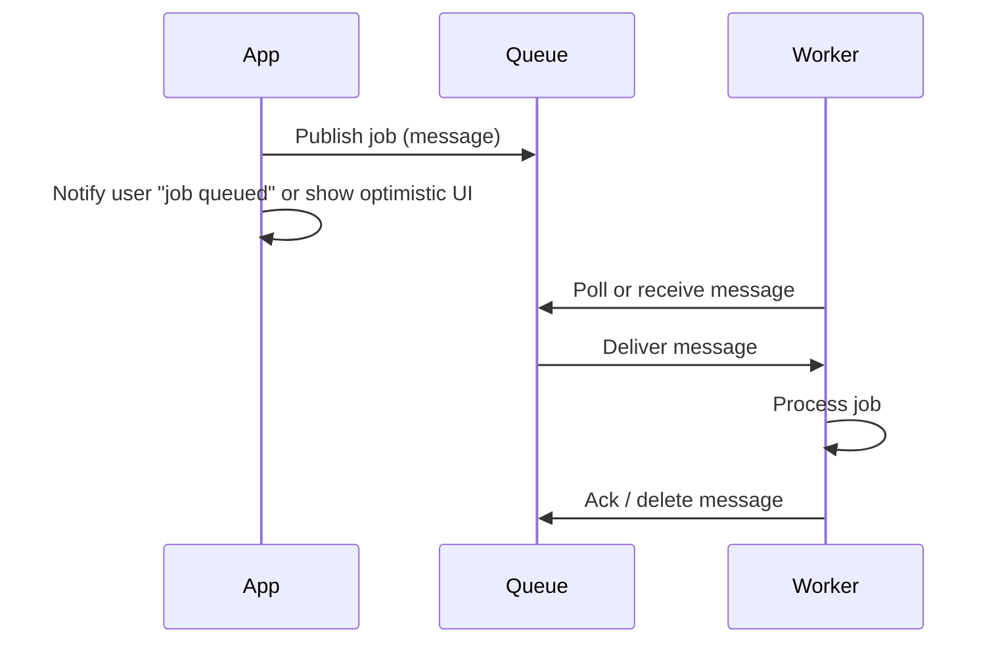

# Message Queues

## What they are

**Message queues** receive, hold, and deliver **messages**. Producers send messages into the queue; consumers take messages out and process them. The queue **decouples** producer and consumer and **absorbs bursts**. The diagram below shows producers, the queue, and consumers.

### Message structure

A message typically has:

- **Body** — The actual payload (text, binary, or structured data such as JSON).
- **Headers** — Metadata: unique identifier, timestamp, message type, routing information.

### Components

| Component | Role |
|-----------|------|
| **Message producer** | Creates and sends messages to the queue. Any part of the system that produces data for sharing. |
| **Message queue** | Stores and manages messages until they are consumed; buffer between producers and consumers. Messages are often stored in FIFO order. |
| **Message consumer** | Retrieves and processes messages from the queue. Multiple consumers can read concurrently (e.g. competing consumers). |
| **Message broker (optional)** | Intermediary that provides routing, filtering, and message transformation between producers and consumers. |

---

## Why we need them

Some operations are **too slow or heavy** to do **inline** in the request path. If we did them synchronously:

- The user would wait a long time.
- The server would hold connections and threads.
- A spike in work could overload the system.

By putting work into a **queue**, we:

- **Return quickly** to the user (e.g. "Job queued" or optimistic UI).
- **Process in the background** with workers that scale independently.
- **Smooth traffic**: the queue holds messages until workers can process them.

We also use queues to **decouple** services (producer and consumer don’t need to be up at the same time) and to **integrate** systems asynchronously (event-driven workflows). In distributed systems, message queues address:

- **Workflow management** — Implement order processing, payment flows, and multi-step pipelines with better efficiency and accuracy.
- **Reliability** — Persistence, retries, and dead-letter queues reduce message loss when components fail.
- **Scalability** — Add more servers or consumers to handle higher message volume.
- **Asynchronous communication** — Send and receive without waiting for a response; essential for scalable, dependable systems.

### Real-life use cases

- **E-commerce** — Put orders in a queue so the customer isn’t blocked; process payments and inventory in the background.
- **Email service** — Consume from an order-confirmation queue and send confirmation emails.
- **Inventory service** — Consume from a payment-completed queue and update stock.
- **Payment service** — Consume from an order queue and process payments.
- **Traffic spikes** — Systems like Uber, Netflix, and Amazon use queues to absorb bursts and keep services responsive.

**Product cases:** WhatsApp-style chat uses queues for group message fan-out ([WhatsApp case](../cases/2-whatsapp.md)). YouTube/Netflix use job queues for video transcoding ([YouTube / Netflix case](../cases/5-youtube-netflix.md)). Uber uses queues for location ingest and analytics ([Uber case](../cases/4-uber.md)).

---

## How it works (flow)

The workflow matches how the topic is usually presented in system design sources:

1. **Send** — Producer creates a message and sends it to the queue (data or instructions to be processed).
2. **Queue** — The queue stores the message temporarily, usually in first-in-first-out (FIFO) order, until one or more consumers are ready.
3. **Consume** — A consumer retrieves messages when ready and processes them at its own pace (asynchronous).
4. **Acknowledgment (optional)** — The consumer can ack back to the queue after successful processing; this supports delivery guarantees and avoids message loss on failure.
5. Optionally, the client can **poll for status** or get a **callback** when the job is done.

Example: posting a tweet. The tweet appears on your timeline right away; delivery to all followers happens asynchronously via a queue and workers.

---

## Message queue vs task queue

| | Message queue | Task queue |
|---|----------------|------------|
| **Focus** | Carry messages; consumer does whatever the app defines. | Explicit **task** + optional **result**; often has scheduling and result backends. |
| **Typical use** | Decoupling, events, async workflows. | Background jobs, batch work, scheduled tasks (e.g. "run in 1 hour"). |
| **Examples** | Redis (simple), RabbitMQ, SQS, Kafka. | Celery (on top of RabbitMQ/Redis), Bull, etc. |

Task queues often sit **on top of** a message broker; the flow (producer → queue → consumer) is the same.

---

## Delivery guarantees

- **At-most-once** — Send once; message may be lost. Lowest latency.
- **At-least-once** — Redeliver until acked; consumer may see **duplicates**. Design **idempotent** handlers.
- **Exactly-once** — Harder; often at-least-once plus **deduplication** (e.g. by idempotency key) on the consumer side.

---

## Examples and trade-offs

| System | Pros | Cons |
|--------|------|------|
| **Redis** | Simple, fast. | Messages can be lost if not persisted. |
| **RabbitMQ** | Flexible routing, AMQP. | You manage nodes; need to adopt AMQP. |
| **SQS** | Hosted, decoupling. | Can have higher latency and duplicate delivery. |
| **Kafka** | Log/stream, replay, ordering per partition. | More complex; better for streams than simple task queues. |

---

## Disadvantages of asynchronism

- **Adds latency** for the full job: user gets a quick response but result comes later.
- **More moving parts**: queue, workers, monitoring, DLQ for failures.
- **Ordering and exactly-once** are harder across multiple consumers.
- For **cheap, real-time** work, synchronous handling may be simpler; use queues when the work is slow or bursty.

---

## When to use

Use message (or task) queues to **offload slow or heavy work** (notifications, image processing, fan-out), **decouple** services, and **smooth traffic spikes**. Combine with [Task queues](2-task-queues.md) for job-oriented processing, [Backpressure](3-backpressure.md) when consumers can’t keep up, and [DLQ](5-dlq-and-reliability.md) for failed messages.
