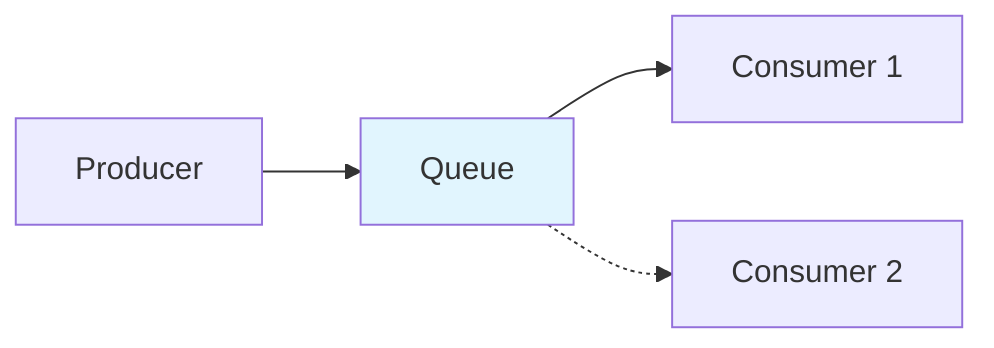
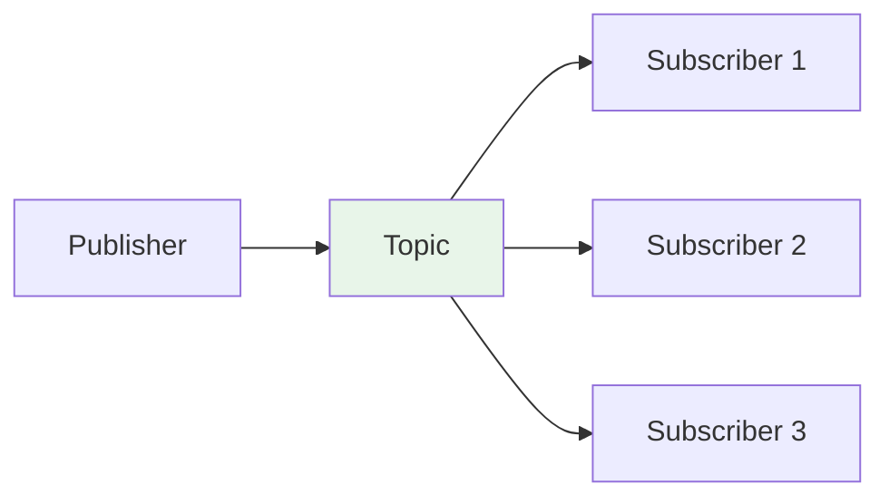

# Types of Message Queues and Messaging Styles

Message brokers support different **distribution patterns** and **queue types**. The two main **message queuing styles** (as in GeeksforGeeks and the cloned repos) are **point-to-point** (queuing) and **publish-subscribe** (pub/sub). Beyond that, queues can differ by delivery semantics, ordering, and features (FIFO, delay, push vs pull, DLQ, etc.).

---

## Why we need different types

- **Point-to-point** — One producer, one (or one group of) consumer(s); each message processed **once**; good for task distribution and job queues.
- **Pub/sub** — One producer, **many** subscribers; each message is **broadcast** to all subscribers; good for events and notifications.
- **Queue features** (FIFO, delay, ordering, DLQ) let you match the queue type to your guarantees and use case (e.g. exactly-once, scheduled jobs, or best-effort throughput).

---

## Two main message queuing styles

### 1. Point-to-point (message queue)

- **One-to-one** (or one producer, one consumer group): the sender sends to a **queue**; **one consumer** (or one of several competing consumers) processes each message.
- **Each message is consumed only once** — no duplication to multiple consumers.
- Messages are typically processed in **FIFO** (first-in-first-out) order, or with best-effort ordering depending on the system.
- **Use case:** Task distribution, job processing, workload distribution where order matters and each job should run once.

**Advantages:**

- Message **ordering** and **persistence** (stored until successfully processed).
- **Reliability** — each message consumed by only one consumer; reduces duplicate processing.
- **Scalability** — distribute workload across multiple competing consumers.
- **Decoupling** — producers and consumers operate independently and at their own pace.
- **Guaranteed delivery** — consumers can retry until messages are successfully processed.

**Disadvantages:**

- A message is processed by **only one** receiver; not suitable when many consumers need the same data.
- Can be **harder to scale** when many consumers must process the same messages (broadcast case).

---

### 2. Publish-subscribe (pub/sub)

- **One-to-many**: the **publisher** publishes to a **topic**; **all subscribers** to that topic receive the message (or a copy).
- Messages are **broadcast** asynchronously to every subscriber; each subscriber can do something different with the same message in parallel.
- **Publisher does not know** who the subscribers are; **subscribers do not know** who the publisher is. The topic is the only contract.
- **Use case:** Event notifications, real-time updates, fan-out to multiple services (e.g. "order placed" → inventory, analytics, email).

**Components (pub/sub):** Publisher, subscriber, **topic** (named channel), **message broker** (routes by subscription), **message**, **subscription** (links subscribers to topics; can define delivery guarantees such as at-most-once or at-least-once). Publishers and subscribers do not need to know each other.

**Advantages:**

- **Real-time** push to subscribers (no polling).
- **Decoupling** — publishers and subscribers scale and change independently; no direct knowledge of each other.
- **Dynamic targeting** — add or remove subscribers without changing the publisher.
- **Fanout** — one message drives many parallel actions; easy to add subscribers.
- **Asynchronous** — subscribers receive messages when published without blocking the publisher.

**Disadvantages:**

- **Ordering** — messages may not always arrive in the order they were sent.
- **Duplication** — subscribers may receive duplicates; higher processing requirements for idempotency.
- **Offline subscribers** — depending on configuration, a subscriber that is offline may miss messages (unless the broker retains and replays).

---

## Comparison: point-to-point vs pub/sub

| | Point-to-point (queue) | Publish-subscribe (topic) |
|--|------------------------|----------------------------|
| **Relationship** | One-to-one (or competing consumers) | One-to-many |
| **Who gets the message** | One consumer (per message) | All subscribers |
| **Typical use** | Job queues, task distribution | Events, notifications, broadcast |
| **Ordering** | Often FIFO or per-partition | Per topic/partition; not always global |
| **Duplicates** | Avoid (single consumer) | Each subscriber gets a copy |

---

## Message routing

**Message routing** determines how messages are directed to recipients:

- **Direct routing** — Messages go to specific queues or consumers by address or routing key.
- **Topic-based routing** — Messages go to topics/channels; subscribers express interest in topics and receive all messages for that topic.
- **Content-based routing** — Routing is based on message content; filters or rules route messages that meet specific criteria.

---

## Queue types and features

Beyond the two styles, queues and brokers offer different **types** and **features**:

### FIFO (first-in-first-out) queues

- The **oldest** message (head of the queue) is processed first. Strict ordering within a queue or partition.
- Some systems (e.g. SQS FIFO) combine this with **exactly-once** delivery by deduplicating on a message group or dedup id.

### Delay / schedule delivery

- **Delay queue**: messages are delivered only after a **delay** (e.g. 5 minutes). Useful for retries or scheduled jobs.
- **Schedule delivery**: deliver at a **specific time**. Use case: "send reminder at 9 AM."

### Push vs pull

- **Pull** — Consumer **polls** the queue for new messages. Simple; consumer controls rate; can add latency.
- **Push** — Broker **pushes** messages to the consumer when available. Lower latency; broker must manage consumer backpressure.
- **Long-polling** — Pull that **waits** for a short time for new messages, reducing empty polls.

### Delivery guarantees

- **At-least-once** — Messages can be redelivered; consumer may see duplicates. Use **idempotent** handlers.
- **Exactly-once** — Each message processed once. Often implemented with FIFO + deduplication (e.g. message group, idempotency key).

### Ordering

- **Best-effort ordering** — Messages are *generally* delivered in send order; at-least-once. Many standard queues work this way.
- **Strict ordering** — FIFO or per-partition ordering so that all messages in a partition are consumed in order.

### Message prioritization

- **Priority levels** — Assign priority so that more important messages are processed before others. Criteria can include: **urgency** (time-sensitive first), **message content** (critical commands or data), or **business rules** (custom algorithms). High-priority messages may be processed before lower-priority ones even if they arrived later.

### Dead-letter queue (DLQ)

- A **separate queue** to which messages that **fail processing** (after N retries) are sent. Also used for messages that cannot be delivered to any consumer, exceed TTL or max delivery attempts, or have content/format errors. Keeps poison messages from blocking the main queue; allows inspection and republish or discard. See [DLQ and reliability](5-dlq-and-reliability.md).

### Poison-pill messages

- **Special messages** that signal "shut down" or "no more work." The consumer receives them but does not process them as normal work; it stops waiting for new inputs (similar to closing a connection). Used for graceful shutdown of consumers.

### Security

- **Authentication** — Only allowed producers/consumers can access the queue or topic.
- **Encryption** — In transit (TLS) and optionally at rest so messages are not readable on the broker.

---

## Message broker vs event streaming

Sources (e.g. Karan’s repo) distinguish:

| | Message broker | Event streaming (e.g. Kafka) |
|--|----------------|------------------------------|
| **Patterns** | Often supports **both** point-to-point (queues) and pub/sub (topics). | Typically **pub/sub style** only: topics, multiple consumer groups. |
| **Volume** | General-purpose; good for moderate throughput. | Built for **high volume**; log-style retention. |
| **Ordering** | Per queue or topic; depends on product. | **Per partition**; strong ordering within a partition. |
| **Retention** | Until consumed or TTL. | **Time-based retention** (e.g. 7 days); consumers can **replay** from offset. |
| **Delivery tracking** | Brokers often **track** which consumer got which message (ack). | Event streaming may **not** track per-consumer delivery; consumers manage their own offset. |
| **Use case** | Task queues, RPC-style, flexible routing. | Event sourcing, stream processing, replay, high-throughput logs. |

Event streaming offers **more scalability and replay** but often **fewer** built-in fault-tolerance features (e.g. per-message ack, DLQ) than traditional message brokers; design for at-least-once and idempotency.

---

## Pub/sub vs other technologies

| Comparison | Summary |
|------------|---------|
| **Pub/sub vs HTTP APIs** | HTTP is synchronous request-response; pub/sub is asynchronous — publishers send without waiting for subscriber responses. |
| **Pub/sub vs WebSockets** | WebSockets give real-time, bidirectional client–server communication (e.g. chat). Pub/sub decouples publishers and subscribers and supports many subscribers without direct connections. |
| **Pub/sub vs streaming (e.g. Kafka)** | Streaming platforms handle continuous data with long-term retention and complex processing. Pub/sub focuses on simpler, real-time message delivery. |
| **Pub/sub vs message queues** | Queues deliver to **one consumer** at a time (point-to-point), with order and delivery guarantees. Pub/sub **broadcasts** to multiple subscribers; better for event-driven, one-to-many use cases. |

---

## When to use / when not to use pub/sub

**Use pub/sub when:**

- You need **event-driven** behaviour — publishers emit events and subscribers react without tight coupling.
- You want **asynchronous** communication — publishers don’t wait for subscribers.
- You need to **scale** by adding publishers or subscribers without changing existing ones.
- Subscribers can **change interests at runtime** (subscribe/unsubscribe to topics).
- Multiple subscribers need the **same** message (broadcast, notifications).

**Avoid pub/sub when:**

- The app is **small** and only a few components talk; pub/sub can add unnecessary complexity.
- You need **strict message ordering** — pub/sub typically does not guarantee order.
- You need **minimal latency** — routing and subscription management can add delay.
- You need **exactly-once** delivery — pub/sub often gives at-least-once or at-most-once; exactly-once is harder.

---

## When to use which

- **Point-to-point** — When each unit of work must be done **once** by one consumer (job queues, task distribution, ordered processing).
- **Pub/sub** — When the same event must be **broadcast** to many subscribers (notifications, events, fan-out).
- **FIFO / exactly-once** — When order and no duplicates are critical (e.g. financial, inventory).
- **Delay / schedule** — When you need retries after a delay or delivery at a specific time.
- **Event streaming** — When you need high throughput, replay, and multiple consumer groups reading the same log. See [Queues vs streams](4-queues-vs-streams.md).
