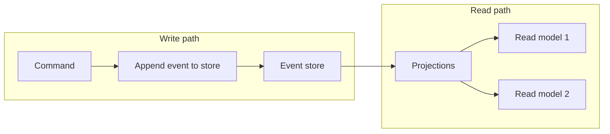

# Event Sourcing

## What it is

Instead of storing only the **current state** of the data in a domain, **event sourcing** uses an **append-only store** to record the **full series of actions** (events) that happened. The event store is the **system of record**. Current state is obtained by **replaying** events or by reading **projections** (materialized views) that are built from those events.

This simplifies complex domains by avoiding a single “current state” model that must stay in sync with the business; it also improves auditability, replay, and the ability to add new read models later.

---

## Why we need it

- **Audit and compliance** — Full history of what happened; you can answer “what did we know when?” and support compensating actions.
- **Flexible read models** — New views (reporting, search, APIs) can be added by defining new projections without changing how events are written.
- **Fail-safety** — State can be **reconstituted** from the event store after a failure or bug.
- **Complex domains** — When the business logic is better expressed as a sequence of events than as a single mutable state table.

---

## How it works (flow)

1. **Write path:** A **command** (e.g. “PlaceOrder”) is validated and turned into one or more **events** (e.g. “OrderPlaced”). Events are **appended** to the event store. There are **no in-place updates** to a “current state” table.
2. **Read path:** Consumers (projectors) read from the event store and update **projections** (materialized views). Queries run against these projections, not against the raw event log. Alternatively, state can be computed on demand by **replaying** events.

So the flow is: **command → event(s) → append to log → projectors build read models → queries hit read models**.

---

## Event sourcing vs event-driven architecture (EDA)

These are often confused; the repos clarify the difference:

| | Event sourcing | Event-driven architecture (EDA) |
|---|----------------|----------------------------------|
| **Purpose** | **How state is stored**: state = sequence of events. | **How systems communicate**: services publish and consume **events** across boundaries. |
| **Focus** | Event **store** as source of truth; replay and projections. | Message broker, async integration, decoupling. |
| **Relation** | Event sourcing is **one way** to implement part of an event-driven system; the event store can feed event-driven consumers. | EDA is broader: any use of events to trigger work or integrate services. |

So: **EDA = events for communication.** **Event sourcing = events as state.**

---

## Advantages

- **Full audit trail** — Every change is an event; history is never lost.
- **Fail-safety** — State can be rebuilt from the event store.
- **Flexible** — New read models without changing the write model.
- **Good for compliance** — Audit logs and point-in-time state come for free from the log.
- **Supports compensating actions** — You can reason about what happened and undo or correct.

## Disadvantages

- **Infrastructure** — Need an efficient, durable event store and possibly a schema registry for event formats.
- **Evolution** — Event schema changes over time; need versioning and compatibility (e.g. old events still readable).
- **Different payloads** — Each event type has its own shape; consumers must handle multiple event types.
- **Replay cost** — Rebuilding state from scratch can be slow if the log is large; use snapshots + replay from snapshot.

---

## When to use

Use event sourcing when you need **full history**, **multiple read models**, or a **clear audit trail** (e.g. financial, compliance). It fits **complex domains** where “what happened” is as important as “current state.” Often combined with **CQRS** (see [CQRS](2-cqrs.md)): event store = write model; projections = read model.
