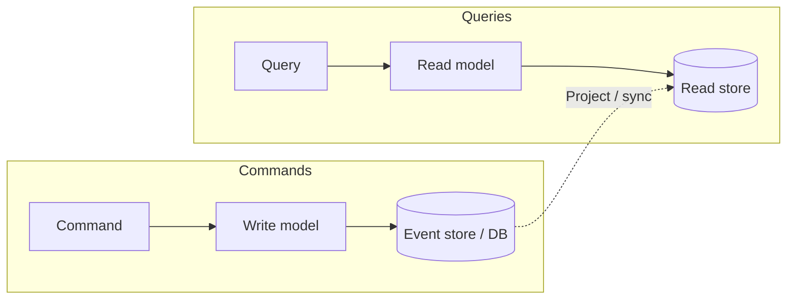

# CQRS

## What it is

**Command Query Responsibility Segregation (CQRS)** is an architectural pattern that **separates** two kinds of operations:

- **Commands** — Instructions to **change** state. They do not return business data, only success/failure (or an id).
- **Queries** — Requests for **information**. They do not change state and have no side effects.

The **write model** (how we process commands) and the **read model** (how we answer queries) can be **different**: different schemas, different stores, and different scaling. They perform fundamentally different roles; separating them lets each be optimized.

---

## Why we need it

- **Scale reads and writes independently** — e.g. many read replicas or a dedicated read store (denormalized, columnar) without complicating the write path.
- **Optimize each side** — Write path for consistency and validation; read path for query shape and latency (e.g. avoid heavy joins).
- **Clear boundaries** — Aligns with the business: “do something” vs “get something.”
- **Easier evolution** — Read models can change (new views, new APIs) without changing how commands are applied.

---

## How it works (flow)

1. **Command** arrives → validated and applied by the **write model** → state (or events) written to the **write store**.
2. **Query** arrives → served from the **read model** (e.g. materialized view, cache, or dedicated read DB). No write path involved.
3. **Sync** between write and read can be **eventual**: projectors or handlers listen to the write store (or event stream) and update the read store. So reads may be slightly stale but can be scaled and tuned separately.

---

## CQRS with event sourcing

The repos often present these together:

- **Event store** = **write model**. Commands produce events; events are appended. The event log is the source of truth.
- **Read model** = **projections** built from events. Typically **denormalized** views tailored to queries (e.g. “orders by customer,” “dashboard stats”).
- **Flow:** Command → event(s) → append to event store → **projectors** consume events and update read stores → queries hit read stores.

So: **commands and events** on one side; **queries and projections** on the other; **eventual consistency** between them.

---

## Advantages

- **Independent scaling** of read and write workloads.
- **Optimization** — Write path for correctness; read path for speed and shape of queries.
- **Simpler read side** — No complex joins if the read model is pre-joined or pre-aggregated.
- **Loose coupling** — Clear separation between “what changed” and “what we show.”
- **Security** — Easier to restrict who can issue commands vs who can run queries.

## Disadvantages

- **More complexity** — Two models to design, build, and operate.
- **Eventual consistency** — Reads can be stale; need to handle this in the UI and APIs.
- **Message failures / duplicates** — If projectors consume from a queue or stream, need **idempotent** handlers and possibly an outbox or DLQ.
- **Maintenance** — More components (event store, projectors, read stores).

---

## When to use

Use CQRS when:

- **Read and write patterns differ a lot** — e.g. many different query shapes, heavy reporting, or write-heavy with simple reads.
- **You need to scale reads separately** — e.g. many read replicas or a dedicated analytics store.
- **The system will evolve** — multiple versions of the model or changing business rules; read models can be added or changed without touching the write model.
- **Integration with other systems** — Combined with event sourcing, so a failing subsystem doesn’t block the rest; events are the contract.

Often used **with** [Event sourcing](1-event-sourcing.md): event store = write model; projections = read model.
