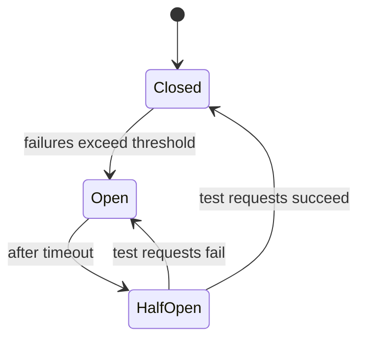

# Circuit Breaker

## What it is

The **circuit breaker** is a design pattern that wraps calls to a remote service (or resource). It monitors failures and, once they exceed a threshold, **trips**: it stops sending requests for a period and returns an error or fallback immediately, preventing cascading failures.

The diagram below illustrates the idea: the circuit sits between the caller and the dependency and can open to block calls when the dependency is failing.

---

## Why we need circuit breaking

Software systems often call remote services—other processes or machines over the network. Unlike in-memory calls, remote calls can:

- **Fail** or **time out** when the dependency is down or slow.
- **Tie up resources** (threads, connections) while waiting.

If many callers keep hitting an **unresponsive** dependency, they can run out of threads or connections. That can bring down the callers too and spread the outage. The circuit breaker **fails fast** and stops calling the dependency so that:

- Callers don’t exhaust resources.
- The dependency gets time to recover.
- You can alert and react when the circuit trips.

---

## How it works (flow)

We wrap the call to the remote service in a **circuit breaker object**. It:

1. Lets requests through while it considers the dependency healthy.
2. Counts failures (or failure ratio).
3. When failures exceed a **threshold**, it **opens**: it no longer calls the dependency and returns an error (or fallback) immediately.
4. After a **timeout**, it moves to **half-open** and allows a **limited number** of test requests through.
5. If those succeed, it **closes** again; if they fail, it goes back to **open**.

So the flow of thought is: **normal → too many failures → open (fail fast) → wait → try a few requests → close or open again**.

---

## States

### Closed

- **Normal operation.** All requests **pass through** to the service.
- Failures are **counted**. When the count (or failure ratio) exceeds the **threshold**, the circuit **trips** and moves to **Open**.

### Open

- The circuit **returns an error immediately** (or a fallback). It **does not call** the remote service.
- After a configured **timeout**, it moves to **Half-open**. A monitoring system usually defines this timeout.

### Half-open

- The circuit allows a **limited number** of requests through to **test** whether the dependency has recovered.
- If these requests **succeed** → circuit moves to **Closed**.
- If they **fail** → circuit goes back to **Open**.

---

## Design choices

| Choice | What to set |
|--------|-------------|
| **Threshold** | e.g. N failures in a time window, or a failure ratio. |
| **Timeout** | How long to stay **Open** before moving to **Half-open**. |
| **Fallback** | What to return when **Open**: cached value, default, or error. |
| **Half-open limit** | How many test requests to allow before deciding. |

---

## Advantages

- Stops cascading failures by failing fast when the dependency is down.
- Gives the remote service time to recover (no constant hammering).
- Callers avoid exhausting threads/connections on a hung dependency.
- Clear signal (circuit open) for monitoring and alerting.

## Disadvantages

- Adds complexity (state machine, tuning of threshold and timeout).
- When open, all requests fail (or use fallback) even if some would have succeeded; need good fallbacks and retry strategy (e.g. exponential backoff) on the client.

---

## When to use

Use a circuit breaker for **any call to an external or unreliable service**: other microservices, third-party APIs, or databases. Combine with **retries** (with backoff and jitter) and **timeouts** so the circuit has clear failure signals. Often implemented together with **bulkhead** (limit concurrent calls) and **retry** (see [Bulkhead and retry](5-bulkhead-and-retry.md)).
