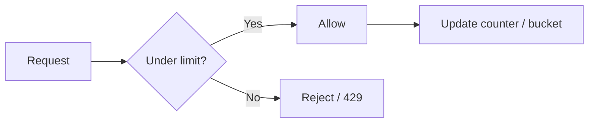

# Rate Limiting

## What it is

**Rate limiting** prevents the **frequency** of an operation from exceeding a defined limit (e.g. requests per second or per minute per user, IP, or API key). It is used to protect services, control cost, and enforce fair use. The diagram below illustrates requests being allowed or rejected based on the limit.

---

## Why we need rate limiting

The cloned repos present this as the main motivations:

- **Avoid resource starvation** — e.g. from DoS: one client or attack shouldn’t consume all capacity.
- **Control cost** — In auto-scaling or pay-per-use systems, rate limits put a **cap** on usage so bills don’t explode.
- **Security** — Mitigate brute-force (e.g. login), scraping, or API abuse.
- **Flow control** — For APIs that process large amounts of data, rate limiting controls how fast data is sent.

---

## How it works (flow)

1. **Request** arrives (identified by user, IP, API key, etc.).
2. **Check** whether the client is under the allowed rate (using one of the algorithms below).
3. If **under limit** → allow and **update** the counter or bucket. If **over limit** → reject (e.g. HTTP 429) or queue.
4. Limits are usually **per time window** or **per token bucket**; they can be **global** (across all nodes) or **per node** (with trade-offs).

---

## Algorithms

Different sources (e.g. Karan’s repo) describe these algorithms as follows:

### Leaky bucket

- Requests are **appended to a queue**. The first item in the queue is **processed at a fixed rate** (FIFO).
- If the **queue is full**, new requests are **discarded** (or “leaked”).
- **Effect**: Smooths bursts; output rate is constant. Can add latency when the queue is full.

### Token bucket

- A **bucket** holds **tokens** that **refill at a fixed rate**. Each request **consumes one token**.
- If **no token** is available, the request is **refused** (client retries later).
- **Effect**: Allows **bursts** up to bucket size, then a steady rate. Often used for APIs.

### Fixed window

- Time is divided into **fixed windows** (e.g. 1 minute). Each request **increments a counter** for the current window.
- If the counter **exceeds the threshold**, the request is **discarded**.
- **Drawback**: At the **boundary** between two windows, a client can send up to **2×** the limit (end of one window + start of next).

### Sliding log

- **Every request** is stored with a **timestamp**. Old entries outside the window are removed.
- For a new request, you **count** how many requests fall in the **last N seconds**. If at or over the limit, the request is **rejected**.
- **Drawback**: More **storage** and **CPU** (many timestamps); accurate for any window.

### Sliding window (hybrid)

- Combines **fixed window** (low cost) with **sliding** behavior: e.g. counter for current window plus a **weighted** count from the previous window based on how much of the current window has elapsed.
- **Effect**: Smoother than fixed window at boundaries; cheaper than full sliding log.

---

## Rate limiting in distributed systems

When you have **multiple nodes** (e.g. API servers behind a load balancer), two issues come up, as in the repos:

### Inconsistencies (global limit)

- If **each node** tracks its own counter, a **single client** can send requests to **many nodes** and exceed the **intended global** limit.
- **Options**: **Sticky sessions** so each client hits one node (simpler but worse for fault tolerance and scaling), or a **central store** (e.g. Redis) so all nodes share the same counter (adds latency and dependency).

### Race conditions

- A naive **“get-then-set”** (read counter, increment, write back) can **race**: two requests both read the same value, both increment, both write; the counter only goes up by one instead of two. That can **under-count** and allow more requests than the limit.
- **Solutions**: Use **atomic** operations (e.g. Redis INCR) or a **“set-then-get”** style so increment-and-check is atomic. **Distributed locks** are another option but can become a bottleneck.

---

## When to use

Use rate limiting for **public or partner APIs**, **login** or **auth** endpoints, and any **shared resource** where one client shouldn’t consume everything. Combine with **backoff** and **429 Retry-After** so clients know when to retry. For **distributed** limits, use a central store with **atomic** counters and accept some extra latency, or use sticky sessions if you can trade off fault tolerance.
